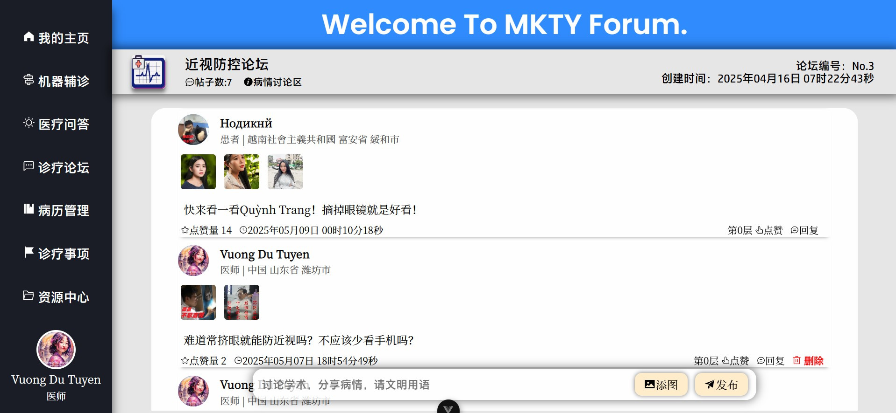
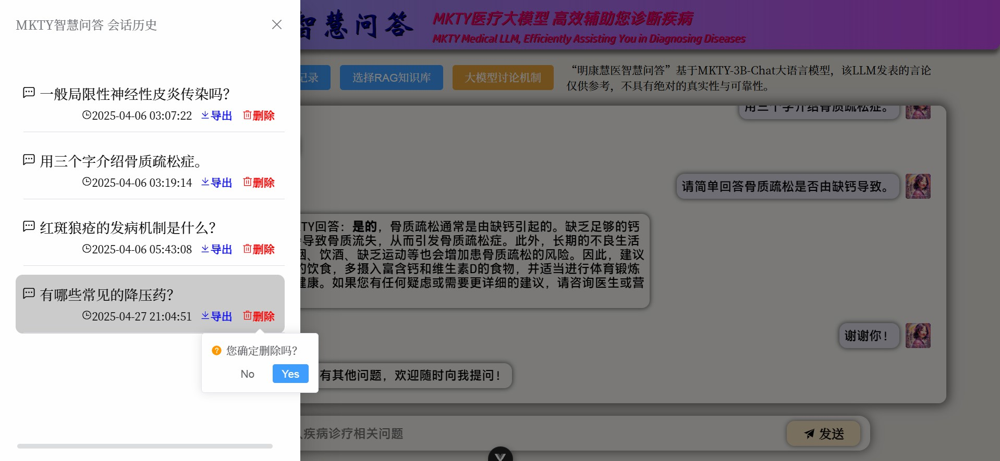
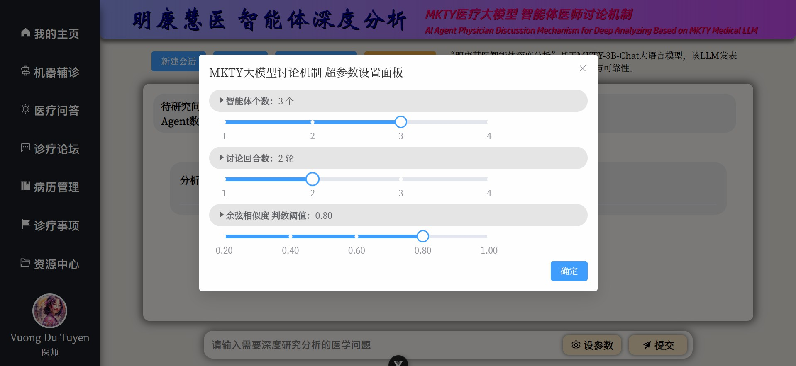
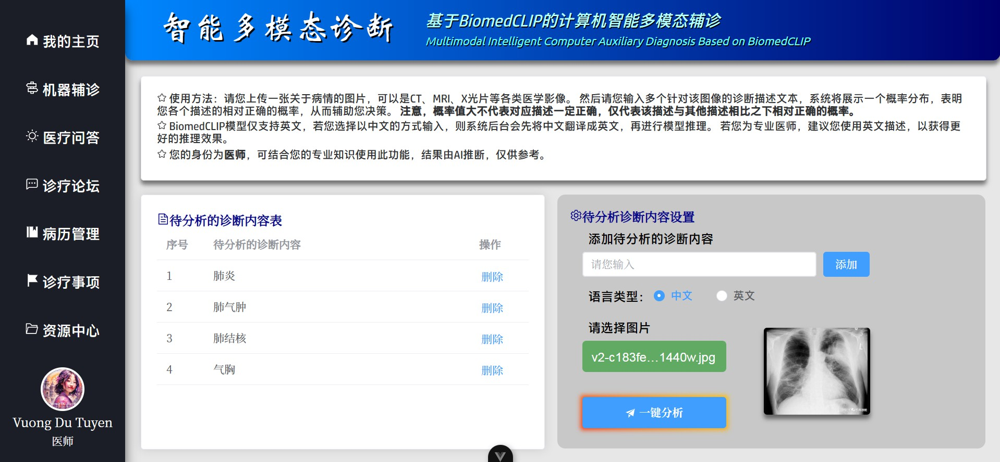

<p align="center">
  <br>
  
  
</p>
<br>

# 明康慧医——基于LLM与多模态人工智能的健康管理与辅助诊疗系统设计与实现

## 🌍 文档语言

<p style="display: flex;align-items: center;">
   
  &nbsp;<a href="./README.md"><b>简体中文</b></a>&nbsp;|&nbsp;
   
  &nbsp;<a href="./README_EN.md"><b>英语 (English)</b></a>&nbsp;|&nbsp;
   
  &nbsp;<a href="./README_VN.md"><b>越南语 (Tiếng Việt)</b></a>
</p>

> 请注意，本文档的英文与越南文版本均使用LLM翻译自中文版本，有人工校对但差错难免，若出现英文或越南文版本内容与中文版本的不一致时，以中文为准。

**项目全称：** 明康慧医（繁体中文：_明康慧醫_；英语：_Minh Khoe Tue Y_；越南语：_Minh Khỏe Tuệ Y_）——基于LLM与多模态人工智能的健康管理与辅助诊疗系统设计与实现 ( **简称:** 明康慧医智慧医疗系统 )

## 📖 项目介绍

以本毕业设计论文的“摘要”部分作为项目介绍：

&nbsp;&nbsp;&nbsp;&nbsp;在新时代互联网应用与技术进一步普及与人工智能技术飞速发展的双重驱动下，计算机技术在医健领域的应用可谓愈加广泛，大众对医健日渐增加的需求难以为传统的诊疗与保健管理模式所满足，其面临的诸多如诊断效率低下、医资配置不均、患者不便利与决策依赖经验等问题已相对严重。因此，如何利用互联网与前沿的人工智能技术，特别是利用大规模语言模型（LLM）与多模态技术来提升医疗保健相关业务的数字化、智能化已成为一个重要的课题。为更好地探讨互联网技术以及大语言模型与多模态等AI技术在医疗领域的潜力，本研究设计并实现了**明康慧医——基于LLM与多模态人工智能的健康管理与辅助诊疗系统**，本人同时也为提高医患交流效率和优化诊疗的流程尽一份作为本科毕业生的微薄之力。

&nbsp;&nbsp;&nbsp;&nbsp;本平台是一个集**注册登录、个人信息管理、多模态智能辅诊、医疗问答、诊疗论坛、病历管理、诊疗事项清单管理、资源中心及后台管理**九大模块于一体的分布式系统平台。系统宏观架构采用前后端分离设计，业务逻辑层后端基于`Python Flask`框架，数据库采用`MySQL`的方案，`RabbitMQ`实现完成业务逻辑端与智能服务端的异步消息通信，构建分布式微服务部署；前端页面组件化与交互效果采用`Vue3`、`axios`与`Element Plus`实现，系统鉴权通过JWT机制实现，保障数据的安全。

&nbsp;&nbsp;&nbsp;&nbsp;在AI智能服务端方面，“智能多模态辅诊”基于`BioMedCLIP`对比学习模型与`MarianMTModel`中英文神经机器翻译模型的级联架构，通过输入的医学影像，计算多条待判中文诊断描述为正确的相对概率分布。医疗问答、问题深度研究及其它语言生成任务均利用`MKTY-3B-Chat`大模型。该LLM以`Qwen2.5-3B-Instruct`为底座，采用`LLaMA-Factory`利用大量医学领域文本微调而成。问题深度研究模块基于“大模型讨论机制”，是为本人自研的一种LLM生成模式，可充分挖掘大模型内部的知识且可引导其推理。

&nbsp;&nbsp;&nbsp;&nbsp;“明康慧医”系统的具体设计与实现过程的描述在本文中得以完整呈现。这次研究首先明确了本系统开发的行业背景与选择上述技术路线的依据，然后在技术可行性角度，分层次解析了核心功能需求与实现方案，系统架构中各模块的工作原理与技术要点在文中以重点说明，全部性能指标在测试环节得到了覆盖测试。本人在文末总结了当前的成果，还作了后续改进方向的计划。这项医疗数字化的项目是为本人的一次探索，如能引发学生们对AI医疗的关注，吸引更多同学参与该领域，这便是本研究最大的价值所在。

**关键词：`医疗数字化`；`辅助诊疗`；`大规模语言模型`；`多模态`；`Vue3`；`Python Flask`；**

**下图展示了项目的系统架构：**

<div style="padding: 15px; text-align:center;">
  
</div><br>

**下图展示了项目的系统功能模块：**

<div style="padding: 15px; text-align:center; background-color: rgb(255,255,255)">
  
</div><br>

## 🛠️ 技术栈

本项目主要使用了以下库、组件或开源项目：

- **前端：** Vue.js、Element Plus、Axios、marked.js、DOMPurify、highlight.js、jQuery
- **后端：** Python Flask、pika、weasyprint、smtplib、PIL、argon2、rich、SQLAlchemy
- **数据库：** MySQL
- **消息队列：** RabbitMQ
- **机器学习与大模型：** PyTorch、Transformers、Qwen2.5-3B-Instruct

## 🤖 人工智能技术

### 明康慧医大模型 (MKTY-3B-Chat)

> 明康慧医大模型权重公开地址：
> [https://huggingface.co/Duyu/MKTY-3B-Chat](https://huggingface.co/Duyu/MKTY-3B-Chat)

&nbsp;&nbsp;&nbsp;&nbsp;明康慧医大模型（英语：_MKTY-3B-Chat Large-scale Language Model_；越南语：_MKTY-3B-Chat Mô hình Ngôn ngữ Quy mô Lớn_）是本项目的重要组成部分，为本人2025级齐鲁工业大学（山东省科学院）计算机科学与技术学部本科毕业设计而开发。

&nbsp;&nbsp;&nbsp;&nbsp;模型参数量`3.09B`，量化精度`BF16`，其在医学、医疗及生物学领域进行了微调与优化，其表现优于底座模型通义千问`Qwen2.5-3B-Instruct`。微调过程采用`LoRA`算法，仅针对中文语言。微调时使用增量预训练`Pretrain`与指令监督微调`SFT`两种方法，并分四个微调步骤进行，具体来说就是一轮增量预训练+一轮指令监督交替进行两次，这样做是考虑到底座模型规模不大，吸收知识的能力跟巨大规模模型相比稍逊一筹，若只进行一轮微调，那么经过SFT后大模型可能会遗忘掉其先在增量训练阶段学习到的知识，执行两轮微调可减轻大模型的灾难性遗忘。

&nbsp;&nbsp;&nbsp;&nbsp;训练数据方面：语料数据包含为生物领域广泛文本、医学诊断与问答、医学考试选择题以及自我意识等。在本项目中，MKTY大模型的使用场景是医疗问答、大模型讨论、总结诊疗计划、根据病历诊断和推荐药物，本人针对这四条用途准备了数据集，医学生物广泛知识文本用以在增量预训练阶段增加大模型的医疗专业知识，医学问答数据集用于指令监督微调，增强大模型回答问题的能力，医学诊断用于增强大模型诊断病历的能力，使用医学考试选择题的目的是告诉模型一个问题及其回答正确答案的回答模式，在大模型讨论机制功能中，不论是独立智能体角色还是主持人角色，都应该针对某问题结合已有的答案做出自己的判断，而教会大模型做医考选择题即可达到训练大模型按这种模式来回答问题的目的。另外“自我意识”是指通过指令监督，使模型得知自己是谁，由谁开发等，这部分数据由我本人设定。

&nbsp;&nbsp;&nbsp;&nbsp;大模型所用训练数据总量约为`2.88 GB`（解压后约为`6.79 GB`），是为从全网各网站平台以及本人个人关系获得的，所有训练数据均为开源的，并且是在不违反开源协议的合法情况下使用的，由于数据来源数量非常大且难以统计，以下仅列出了主要的数据来源网址，所有数据用于训练前都做过二次清洗和规整格式等预处理：

| 部分数据来源网址 |
| ----- |
| https://huggingface.co/datasets/Flmc/DISC-Med-SFT/tree/main |
| https://huggingface.co/datasets/Bolin97/MedicalQA/tree/main |
| https://huggingface.co/datasets/tyang816/MedChatZH/tree/main |
| https://huggingface.co/datasets/TigerResearch/MedCT/tree/main |
| https://huggingface.co/datasets/hajhouj/med_qa/tree/main |
| https://huggingface.co/datasets/ChenWeiLi/Medtext_zhtw |
| 其它数据集（从略） |

&nbsp;&nbsp;&nbsp;&nbsp;感谢上述开源数据集的提供者为本研究提供的帮助。另外，下方的损失值图展示了大模型在增量训练微调过程中交叉熵损失下降的过程。增量训练时设置了3个多epoch，每个epoch需遍历训练6000个批次的数据，共训练20000个批次，下图可以直观的看出损失。


### 智能体深度分析

&nbsp;&nbsp;&nbsp;&nbsp;智能体深度分析功能基于本人自研的大模型讨论机制`LLMDM`。该方法有智能体个数、讨论回合数与判敛阈值三个超参数，完全相同的若干大模型（`MKTY-3B-Chat`）在会话上下文不同时不认为是同一个智能体。第一轮讨论过程是，系统通过设置多个上下文数组模拟多个智能体，让每个智能体分别回答待深入研究的问题，然后由没有会话上文的“主持人”智能体总结各方发言。以后每轮讨论，都将上轮主持人的总结和原问题拼接合并，并由各智能体基于自己的会话上下文再分别回答合并后的prompt，最后主持人总结，周而复始,直至达到最大讨论轮次数。

&nbsp;&nbsp;&nbsp;&nbsp;然后是“判敛”的过程：用`BigBird`将最后一轮讨论各方的输出计算句子嵌入向量，然后计算各向量两两之差的平均值，以此反应各方达成共识的程度，即讨论语义收敛程度，这个数值可供人类用户作参考。

### 融合文本的时间序列预测模型

&nbsp;&nbsp;&nbsp;&nbsp;目前基于深度学习方法的各领域时间序列预测问题所使用最多的算法是`LSTM`或`GRU`，直至去年（2024年）也才有学者受NLP技术的启发提出基于`Transformer`的时序预测模型，但这些方法都没有考虑到时间序列与多模态相结合。

&nbsp;&nbsp;&nbsp;&nbsp;本次研究中，本人基于`GRU`，尝试性地设计了一种基于医学文书的医疗时间序列预测模型，模型原理：主要使用门控循环单元进行初步的时间序列预测，而后通过FFT计算历史时间序列的频域，将频域中各频率序数对应的振幅向量与相位向量拼接得到频域特征，随后用`BigBird`提取医学文本描述的句子嵌入，利用交叉注意力机制计算出频域联合特征向量与该句子嵌入的分数矩阵，从而得出加权频域联合特征。将此特征向量拆解并求逆FFT可得到一个差值时序数据，与此同时将求逆FFT前的频域数据通过一个线性层，求得一个阈值向量，利用门控的思想将这个阈值向量与求得的差值时序数据相乘，再加到基础GRU输出的结果上，作为模型最终的输出。

&nbsp;&nbsp;&nbsp;&nbsp;这样设计的思想在于，时间序列的频域反映了序列的整体情况，而不像时域那样局限于局部时间，计算文本特征与序列频域特征的交叉注意力因而有意义，比如以心电图举例，文本描述“心跳加速”，那么从频域角度看，这句话代表的是整个心电图波形更高频部分的振幅增大，这很容易通过交叉注意力向某高频部分的振幅加权权重增大来反映出来，而时序数据理论上无法体现。

**下图展示了时序预测模型结构：**

<div style="padding: 10px; text-align:center; background-color: rgb(255,255,255)">
  
</div>

#### 公式化表达

<details>

<summary><b>单击此处展开模型公式化表达</b></summary>

##### 1. 文本编码部分

首先，将输入的医学文本信息 $T$ 通过预训练的`BigBird`文本编码器进行编码，得到文本特征向量 $H_T$：

$$
H_T = \text{BigBird}(T)
$$

其中，`BigBird`的参数是冻结的，不参与后续训练。

##### 2. 医学时间序列频域转换

输入的医学时间序列数据 $X$ 通过快速傅里叶变换 (`FFT`) 得到频域表示 $X_f$：

$$
X_f = \text{FFT}(X)
$$

##### 3. 序列时域特征提取

时间序列同时输入到`GRU`网络提取时序特征 $H_s$：

$$
H_s = \text{GRU}(X)
$$

##### 4. 交叉注意力机制

将文本编码的结果 $H_T$ 生成 Query ($Q$) 和 Key ($K$)，频域特征 $X_f$ 生成 Value ($V$)：

$$
Q = W_Q H_T,\quad K = W_K H_T,\quad V = W_V X_f
$$

计算注意力分数：

$$
A = \text{Softmax}\left(\frac{QK^T}{\sqrt{d_k}}\right)
$$

得到交叉注意力输出：

$$
O = A \cdot V
$$

##### 5. 门控机制

将交叉注意力输出 $O$ 经过 `Sigmoid` 函数，作为门控因子 $G$：

$$
G = \text{Sigmoid}(\text{IFFT}(O))
$$

##### 6. 模态融合

门控因子 $G$ 与 `GRU` 输出 $H_s$ 进行加权融合：

$$
H_f = G \cdot H_s
$$

最后，将融合后的特征输入全连接层进行预测：

$$
\hat{Y} = \text{Dense}(H_f + H_s)
$$

##### 符号说明

* $T$：医学文本
* $X$：医学时间序列数据
* $H_T$：文本编码特征
* $X_f$：时间序列频域表示
* $H_s$：时间序列时域特征
* $Q, K, V$：交叉注意力的 Query、Key、Value
* $A$：注意力矩阵
* $O$：交叉注意力输出
* $G$：门控因子
* $H_f$：融合后的特征
* $\hat{Y}$：预测结果
* $W_Q, W_K, W_V$：可学习权重矩阵

</details>

## 🚀 项目运行

### 1. 硬件配置

&nbsp;&nbsp;&nbsp;&nbsp;本系统是一个分布式系统，建议按性能要求部署至多台服务器，业务逻辑后端、数据库端、SSR前端服务器无特别要求。有明显性能要求的部分是智能服务层，其中明康慧医大模型权重及推理时缓存等共需8GB显存，BioMedCLIP需2GB显存，BigBird需2GB显存，时序预测模型显存占用可忽略。只部署一部分或不部署智能服务层也可以启动系统，但只能启动系统业务逻辑后端和CSR/SSR前端，且系统中相应AI服务不可用。

### 2. 克隆代码及模型权重

#### （1）代码克隆

```bash
git clone https://github.com/duyu09/MKTY-System.git
```

#### （2）模型权重下载

- （1）明康慧医大模型仓库大小：`6.19 GB`

```bash
git lfs install
git clone https://huggingface.co/Duyu/MKTY-3B-Chat
```

- （2）BioMedCLIP模型仓库大小：`790 MB`

```bash
git lfs install
git clone https://huggingface.co/microsoft/BiomedCLIP-PubMedBERT_256-vit_base_patch16_224
```

- （3）MarianMT模型仓库大小：`1.18 GB`

该仓库无需专门克隆，当小规模模型模块首次启动时，`transformers`库会自动从`Hugging Face`下载该模型到系统缓存目录，部署时须确保磁盘空间充足。考虑到服务器可能位于中国大陆地区，项目中所有涉及联系`Hugging Face`的代码文件头部已添加设置进程环境变量的语句，目的是将<https://huggingface.co/>重定向至中国国内镜像站<https://hf-mirror.com/>，若您的服务器不在中国大陆管辖网段内，请删除相关代码语句。

- （4）MKTY融合文本的医学时间序列预测模型

暂不开放预训练模型。模型权重大小不超过`10 MB`。

### 3. 环境搭建

&nbsp;&nbsp;&nbsp;&nbsp;针对不同服务，环境依赖也不同。本系统业务逻辑后端及智能服务后端均依赖`Python 3.9+`环境以及`RabbitMQ`消息队列，`RabbitMQ`又依赖`Erlang`语言环境。安装`Python`及`RabbitMQ`的方法此处不再赘述，请访问[Python官方网站](https://www.python.org/downloads/)以及[RabbitMQ官方网站](https://www.rabbitmq.com/download.html)。另外，部署时建议建立虚拟环境。

#### （1）业务逻辑后端

##### 环境安装

```bash
pip install -r requirements-rp.txt
```

##### 代码文件

`\backend\run.py`、`\backend\util.py`。

注意，`weasyprint`库依赖外部软件才能正常工作，该库的具体依赖项取决于操作系统等各种因素而不同，请就您的具体情况参考网络资源解决这个问题。

#### （2）大规模模型推理

##### 环境安装

```bash
pip install -r requirements-lm.txt
```

注意：`torch`和`transformers`库的版本取决于您的硬件环境和CUDA版本，请参考[PyTorch官方网站](https://pytorch.org/get-started/locally/)安装合适的版本。

##### 代码文件

`\backend\large_model.py`、`\backend\large_model_util.py`，以及您克隆的明康慧医大模型目录。

#### （3）小规模模型推理

##### 环境安装

```bash
pip install -r requirements-mm.txt
```

注意：`torch`和`transformers`库的版本取决于您的硬件环境和CUDA版本，请参考[PyTorch官方网站](https://pytorch.org/get-started/locally/)安装合适的版本。

##### 代码文件

`\backend\modest_model.py`、`\backend\modest_model_util.py`，以及您克隆的BioMedCLIP模型目录。

#### （4）数据库建立

&nbsp;&nbsp;&nbsp;&nbsp;本系统依赖`MySQL`数据库，由于涉及JSON的存取，故须8.0及以上的版本。数据库的安装此处不再赘述，具体安装步骤请参考[MySQL官方网站](https://dev.mysql.com/doc/)。数据定义语言（建库SQL脚本）：`\backend\script.sql`，请执行之以建库。

#### （5）前端代码

&nbsp;&nbsp;&nbsp;&nbsp;本系统前端使用`Vite`打包工具进行开发时调试、运行和打包，并建议使用`Node v22.12.0+`环境和`yarn`包管理器，具体请分别参考[Node.js官方网站](https://nodejs.org/)和[Yarn官方网站](https://yarnpkg.com/)。前端代码目录：`\frontend`

#### （6）后台管理系统

&nbsp;&nbsp;&nbsp;&nbsp;本系统后台管理系统（后管端）也是基于`Python Flask`框架与`Vue`+`Vue-cli`进行开发，建议使用`Python 3.9+`与`Node v22.12.0+`环境。后管端前端代码目录：`\admin_frontend`，后管端后端代码目录：`\admin_backend`。

### 4. 部署运行

将代码、模型，以及各种环境、依赖均安装部署完毕后，**请先根据您的各项具体部署情况等修改代码中的全局变量** （如模型路径、数据库连接信息等各项信息），然后启动系统。可配置项位于`run.py`、`modest_model.py`、`large_model.py`代码文件的头部，具体内容此处不做赘述。另外，启动前，请您确保MySQL数据库服务以及各模块的RabbitMQ服务均已正常启动。

#### （1）业务逻辑后端

```bash
python \backend\run.py
```

#### （2）大规模模型推理

```bash
python \backend\large_model.py
```

#### （3）小规模模型推理

```bash
python \backend\modest_model.py
```

#### （4）前端代码

前端代码中`\frontend\src\api\api.js`文件的头部配置了业务逻辑后端API的路径及接口，请您修改后再启动和打包。

```bash
cd \frontend
yarn install  # 初始化
yarn dev  # 启动开发模式服务器
yarn build  # 打包构建
```

构建后的包可以通过多种方式部署、启动，比如使用`Nginx`反向代理服务器，请参考[Nginx官方文档](https://nginx.org/en/docs/)。也可以利用Python解释器直接运行，以下是示例命令：

```bash
cd dist
python -m http.server 8092
```

## 💻 系统前端UI效果

下列表格展示了部分系统前端UI效果，请放大图片查看。

| | | | |
| ----- | ----- | ----- | ----- |
|  |  |  |  |
|  |  |  |  |
|  |  |  |  |
|  |  |  |  |
|  |  |  |  |

## 🎓 项目作者及著作权声明

```
██\      ██\     ██\   ██\   ████████\  ██\     ██\
███\    ███ |    ██ | ██  |  \__██  __| \██\   ██  |
████\  ████ |    ██ |██  /      ██ |     \██\ ██  /
██\██\██ ██ |    █████  /       ██ |      \████  /
██ \███  ██ |    ██  ██<        ██ |       \██  /
██ |\█  /██ |    ██ |\██\       ██ |        ██ |
██ | \_/ ██ |██\ ██ | \██\ ██\  ██ |██\     ██ |██\
\__|     \__|\__|\__|  \__|\__| \__|\__|    \__|\__|
```

该项目用于2025年齐鲁工业大学（山东省科学院）计算机科学与技术学部毕业设计。

### 👤 项目作者

- **杜宇** (英语：_Du Yu_；越南语：_Đỗ Vũ_；电邮：<202103180009@stu.qlu.edu.cn> 与 <qluduyu09@163.com>)，齐鲁工业大学（山东省科学院）计算机科学与技术学部 2025届本科毕业生
- 项目参与者：**郭长霖** (英语：_Guo Changlin_；越南语：_Quách Trường Lâm_；电邮：<202311143014@stu.qlu.edu.cn> 与 <changlin539@163.com>)，齐鲁工业大学（山东省科学院）计算机科学与技术学部 2023级本科生，其参与编写的代码已在注释中明确标注。

### 🏫 毕业设计指导教师

- 校方老师：**姜文峰** (英语：_Jiang Wenfeng_；越南语：_Khương Văn Phong_)，齐鲁工业大学（山东省科学院）计算机科学与技术学部 讲师
- 企业方老师：**李君** (英语：_Li Jun_；越南语：_Lý Quân_)，安博教育科技集团([NYSE: AMBO](https://www.nyse.com/quote/XASE:AMBO)) 山东师创软件实训学院

### ⚖️ 开源协议

&nbsp;&nbsp;&nbsp;&nbsp;本系统基于 **添加了附加条款** 的`MPL-2.0` **(Mozilla Public License 2.0)** 开源协议公开发布，您下载、使用、修改、发布本软件系统项目或其源代码前请认真阅读并完全知晓、充分理解[LICENSE](./LICENSE)文件中的内容。

<details>

<summary><b>单击此处展开附加条款</b></summary>

-----

下述附加条款内容翻译自`LICENSE`文件结尾的英文，下述汉语翻译仅供参考。

#### 附加条款

##### 第1条

若本代码的任何部分（无论修改与否）被用于其他项目，则相关文件必须以`MPL-2.0`或兼容许可证开源。  

##### 第2条

必须在产品的文档、`README`或关于页面中明确声明对本软件的使用，包括以下内容；

- 本项目的名称；
- 官方仓库的链接；
- 原始作者的姓名或化名。  

##### 第3条

不得以任何方式混淆、删除或隐瞒本软件的开源性质及其在项目中使用的事实。

##### 第4条

著作权信息标注多语言要求

为了确保著作权与作者信息得到准确透明的标注，除非符合第`4.3`条所述豁免情形，必须遵守以下多语言要求：

##### 4.1 标注范围要求

在呈现著作权信息时，必须同时满足以下两种语言要求（除非符合第`4.3`条豁免情形）：

- ① 使用者国籍国现行有效的法定语言至少一种（若该国无法定语言，则采用该国事实上的通用语言）
- ② 中文（简体/繁体）、英语或越南语至少一种

##### 4.2 专有名词翻译规范

涉及项目的专有名词（含人名、机构名、作品名等）须优先采用本项目 README 文档提供的汉/英/越标准译法。如需翻译为其他语言，应遵循下列优先级：

- ① 目标语言所属国的强制性法律规定
- ② 国际标准化组织（ISO）相关规范
- ③ 外交领域的国际惯例

##### 4.3 语言数量豁免

符合以下任一情形时可免除多语言标注要求：

- 使用者国籍国的法定/通用语言本身属于中文（简体/繁体）、英语或越南语中的一种或多种
- 目标使用地区的法律有更严格的标注要求

##### 4.4 违规后果

未按本要求进行标注的行为，将被视为试图混淆或隐瞒：

- 本软件开源的事实
- 该开源项目在被使用作品中的实际应用事实
  
-----

</details>

#### 说明

1. 再次强调，请务必遵守`LICENSE`文件中规定的内容（MPL-2.0+附加条款）， **本人对侵犯著作权的行为持“零容忍”态度。** 本人完全赞成并欢迎他人使用本项目及源代码，但对于任何违反协议的侵权行为，本人必将对其追究法律责任，并要求其受到法律限度内最严厉的处罚与赔偿（顶格处罚）。

2. 侵权风险提示：将本项目的部分或全部当作商品售卖（包括但不限于以“课程设计”、“毕业设计”等名义）在`MPL-2.0`协议及附加条款中并不明确反对，但必须在醒目的位置标明本项目的名称（至少包含简称“明康慧医”）、原始作者（至少包含“杜宇”）、官方开源仓库链接（[https://github.com/duyu09/MKTY-System](https://github.com/duyu09/MKTY-System)）否则将有试图“混淆或隐瞒本软件的开源性质及其在项目中使用的事实”的嫌疑。

3. 若您发现有任何违反开源协议及上述内容的个人或组织，欢迎举报，举报方式包括但不限于向本项目任何一名作者发送举报邮件，或在项目所在的开源平台提起issue等方式。

## 🔗 友情链接

- 齐鲁工业大学（山东省科学院）: [https://www.qlu.edu.cn/](https://www.qlu.edu.cn/)
  
- 山东省计算中心（国家超级计算济南中心）: [https://www.nsccjn.cn/](https://www.nsccjn.cn/)

- 齐鲁工业大学（山东省科学院）计算机科学与技术学部: [http://jsxb.scsc.cn/](http://jsxb.scsc.cn/)

- 杜宇的GitHub主页: [https://github.com/duyu09/](https://github.com/duyu09/)

- 杜宇的Hugging Face主页: [https://huggingface.co/Duyu](https://huggingface.co/Duyu)

## 📊 访客统计

<div><b>Number of Total Visits (All of Duyu09's GitHub Projects): </b><br></div> 

<div><b>Number of Total Visits (MKTY): </b>
<br></div> 

