<p align="center">
  <br>
  
  
</p>
<br>

# Minh Khỏe Tuệ Y - Hệ Thống Y Liệu Trí Tuệ

## 🌍 Ngôn Ngữ Tài Liệu

<p style="display: flex;align-items: center;">
  
  &nbsp;<a href="./README.zh-CN.md"><b>Tiếng Trung Giản Thể (简体中文)</b></a>&nbsp;|&nbsp;
  
  &nbsp;<a href="./README.md"><b>Tiếng Anh (English)</b></a>&nbsp;|&nbsp;
  
  &nbsp;<a href="./README.vi.md"><b>Tiếng Việt</b></a>
</p>

> Lưu Ý: Phiên bản tiếng Anh và tiếng Việt của tài liệu này được dịch tự động từ bản gốc tiếng Trung bởi LLM, đã qua hiệu đính thủ công nhưng không tránh khỏi sai sót. Trong trường hợp có sự khác biệt giữa các phiên bản, bản tiếng Trung là bản chính xác nhất.

**Tên đầy đủ dự án:** Minh Khỏe Tuệ Y (Tiếng Trung Giản Thể: _明康慧医_; Chữ Nôm: _明劸慧醫_; Tiếng Anh: _Minh Khoe Tue Y_) – Thiết kế và triển khai hệ thống quản lý sức khỏe và hỗ trợ chẩn đoán y tế dựa trên LLM và trí tuệ nhân tạo đa mô thức ( **Tên viết tắt:** Minh Khỏe Tuệ Y – Hệ Thống Y Liệu Trí Tuệ )

## 📖 Giới Thiệu Dự Án

Dưới đây là phần “Tóm tắt” của luận văn tốt nghiệp, đóng vai trò như phần giới thiệu dự án:

&nbsp;&nbsp;&nbsp;&nbsp;Trong bối cảnh sự phổ cập sâu rộng của các ứng dụng Internet hiện đại và sự phát triển vượt bậc của công nghệ trí tuệ nhân tạo, ứng dụng công nghệ máy tính trong lĩnh vực y tế ngày càng trở nên phổ biến. Nhu cầu chăm sóc sức khỏe ngày càng tăng cao của công chúng đang vượt ngoài khả năng đáp ứng của các mô hình chẩn đoán và quản lý truyền thống. Các vấn đề như hiệu quả chẩn đoán thấp, phân bố nguồn lực y tế không đồng đều, sự bất tiện của bệnh nhân và sự phụ thuộc vào kinh nghiệm trong quyết định điều trị đã trở nên nghiêm trọng. Do đó, làm thế nào để tận dụng công nghệ Internet và trí tuệ nhân tạo tiên tiến – đặc biệt là mô hình ngôn ngữ lớn (LLM) và công nghệ đa mô thức – nhằm nâng cao mức độ số hóa và trí tuệ hóa trong các hoạt động chăm sóc sức khỏe trở thành một đề tài quan trọng.

&nbsp;&nbsp;&nbsp;&nbsp;Với mục tiêu khám phá tiềm năng ứng dụng của công nghệ Internet và các kỹ thuật AI như mô hình ngôn ngữ lớn và công nghệ đa mô thức trong lĩnh vực y tế, nghiên cứu này đã thiết kế và triển khai **Minh Khỏe Tuệ Y – Hệ thống quản lý sức khỏe và hỗ trợ chẩn đoán y tế dựa trên LLM và trí tuệ nhân tạo đa mô thức**. Đồng thời, với tư cách là sinh viên đại học, tôi hy vọng đóng góp một phần nhỏ vào việc nâng cao hiệu quả giao tiếp giữa bác sĩ và bệnh nhân cũng như tối ưu hóa quy trình chẩn đoán.

&nbsp;&nbsp;&nbsp;&nbsp;Nền tảng này là một hệ thống phân tán tích hợp **chín mô-đun chính**: đăng ký và đăng nhập, quản lý thông tin cá nhân, hỗ trợ chẩn đoán thông minh đa mô thức, hỏi đáp y tế, diễn đàn y học, quản lý bệnh án, danh sách công việc chẩn đoán điều trị, trung tâm tài nguyên và quản trị hệ thống. Kiến trúc hệ thống áp dụng thiết kế tách biệt frontend-backend; phía backend triển khai bằng khung `Python Flask`, cơ sở dữ liệu sử dụng `MySQL`, truyền thông bất đồng bộ giữa backend và dịch vụ thông minh sử dụng `RabbitMQ`, tạo nên một hệ thống microservice phân tán. Frontend được phát triển theo hướng component với `Vue3`, `axios` và `Element Plus`, cơ chế xác thực người dùng sử dụng JWT để đảm bảo an toàn dữ liệu.

&nbsp;&nbsp;&nbsp;&nbsp;Ở phía dịch vụ AI thông minh, mô-đun “Hỗ trợ chẩn đoán đa mô thức” dựa trên mô hình học so sánh `BioMedCLIP` kết hợp với mô hình dịch máy thần kinh Trung - Anh `MarianMTModel`, tạo nên cấu trúc chuỗi để đánh giá xác suất tương đối của các mô tả chẩn đoán tiếng Trung từ hình ảnh y tế đầu vào. Các tác vụ như hỏi đáp y tế, nghiên cứu sâu câu hỏi và sinh ngôn ngữ khác sử dụng mô hình LLM `MKTY-3B-Chat`, được tinh chỉnh từ `Qwen2.5-3B-Instruct` bằng `LLaMA-Factory` dựa trên tập văn bản chuyên ngành y học. Mô-đun nghiên cứu chuyên sâu về câu hỏi được triển khai theo “Cơ chế thảo luận LLM”, một phương pháp do tôi tự nghiên cứu nhằm khai thác kiến thức nội tại của mô hình và định hướng suy luận.

&nbsp;&nbsp;&nbsp;&nbsp;Quá trình thiết kế và triển khai chi tiết của hệ thống “Minh Khỏe Tuệ Y” được trình bày đầy đủ trong luận văn này. Nghiên cứu bắt đầu từ việc phân tích bối cảnh ngành và cơ sở lựa chọn công nghệ, sau đó phân tích theo từng tầng kỹ thuật để mô tả yêu cầu chức năng cốt lõi và phương án thực hiện. Nguyên lý hoạt động và điểm kỹ thuật chính của từng mô-đun trong kiến trúc hệ thống được giải thích cụ thể. Tất cả chỉ số hiệu năng đã được kiểm thử toàn diện. Cuối luận văn là phần tổng kết kết quả và kế hoạch cải tiến trong tương lai. Đây là một hành trình khám phá cá nhân trong lĩnh vực số hóa y tế; nếu có thể khơi gợi sự quan tâm của sinh viên đến AI trong y học và thu hút nhiều người tham gia, thì đó chính là giá trị lớn nhất của nghiên cứu này.

**Từ Khóa:** `Số hóa y tế`; `Hỗ trợ chẩn đoán`; `Mô hình ngôn ngữ lớn`; `Đa mô thức`; `Vue3`; `Python Flask`;

**Hình Dưới Đây Minh Họa Kiến Trúc Hệ Thống Của Dự Án:**

<div style="padding: 15px; text-align:center;">
  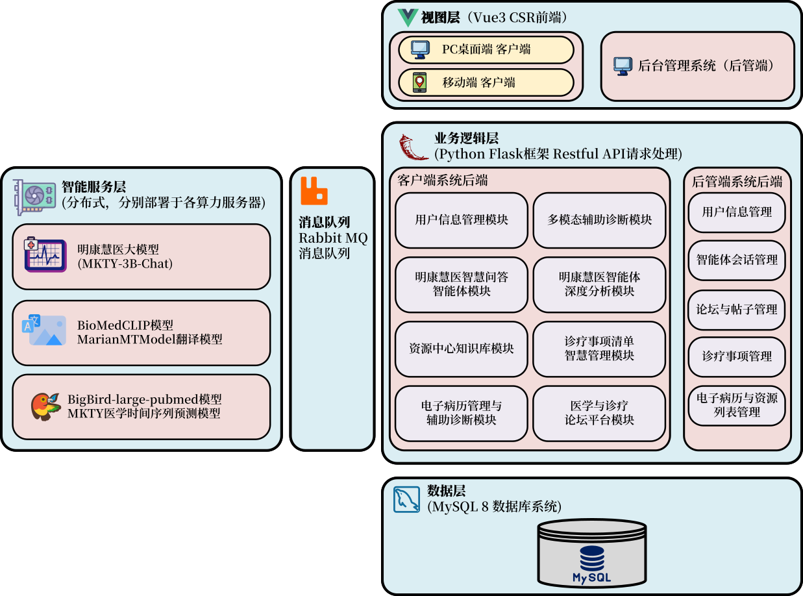
</div><br>

**Hình Dưới Đây Minh Họa Các Mô-Đun Chức Năng Của Hệ Thống:**

<div style="padding: 15px; text-align:center; background-color: rgb(255,255,255)">
  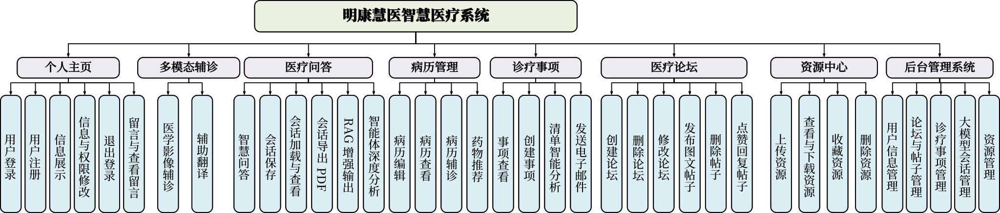
</div><br>

## 🛠️ Ngăn Xếp Kỹ Thuật

Dự án sử dụng các thư viện, thành phần và dự án mã nguồn mở sau:

- **Frontend:** Vue.js, Element Plus, Axios, marked.js, DOMPurify, highlight.js, jQuery
- **Backend:** Python Flask, pika, weasyprint, smtplib, PIL, argon2, rich, SQLAlchemy  
- **Cơ sở dữ liệu:** MySQL  
- **Hàng đợi thông điệp:** RabbitMQ  
- **Học máy & mô hình lớn:** PyTorch, Transformers, Qwen2.5-3B-Instruct

## 🤖 Công Nghệ Trí Tuệ Nhân Tạo

### MKTY-3B-Chat Mô Hình Ngôn Ngữ Quy Mô Lớn

> Địa chỉ công khai trọng số mô hình MKTY-3B-Chat:  
> [https://huggingface.co/Duyu/MKTY-3B-Chat](https://huggingface.co/Duyu/MKTY-3B-Chat)

&nbsp;&nbsp;&nbsp;&nbsp;**MKTY-3B-Chat Mô hình Ngôn ngữ Quy mô Lớn** (Tiếng Trung Giản Thể: _明康慧医大模型_; Tiếng Anh: _MKTY-3B-Chat Large-scale Language Model_) là một thành phần quan trọng của dự án này, được phát triển như một phần của luận văn tốt nghiệp đại học niên khóa 2025 của tôi tại **Đại học Công nghiệp Tề Lỗ (_Qilu_) (Viện Khoa học tỉnh Sơn Đông)**, trực thuộc **Học bộ Khoa học và Kỹ thuật Máy tính**.

&nbsp;&nbsp;&nbsp;&nbsp;Mô hình có quy mô `3.09B` tham số, sử dụng định dạng lượng hóa `BF16`. Mô hình được tinh chỉnh và tối ưu hóa trong các lĩnh vực **y học**, **y tế** và **sinh học**, với hiệu suất vượt trội so với mô hình nền `Qwen2.5-3B-Instruct` (Tiếng Trung Giản Thể: _通义千问_, Tiếng Việt: _Thông Nghĩa Nghìn Vấn_). Quá trình tinh chỉnh áp dụng thuật toán `LoRA`, chỉ tập trung cho ngôn ngữ **tiếng Trung**. Chiến lược tinh chỉnh bao gồm **huấn luyện gia tăng (Pretrain)** và **tinh chỉnh giám sát theo chỉ thị (SFT)**, thực hiện theo bốn bước xen kẽ: một vòng huấn luyện gia tăng và một vòng tinh chỉnh SFT được lặp lại hai lần, nhằm giảm thiểu hiện tượng "quên thảm họa" khi mô hình quy mô nhỏ bị mất kiến thức học được trong giai đoạn trước.

&nbsp;&nbsp;&nbsp;&nbsp;**Dữ liệu huấn luyện** bao gồm văn bản rộng khắp trong lĩnh vực sinh học, hỏi đáp y học, đề thi trắc nghiệm y học và các thông tin nhận thức bản thân. Các tình huống ứng dụng chính của mô hình MKTY trong dự án này gồm: hỏi đáp y tế, thảo luận mô hình lớn, lập kế hoạch chẩn đoán và điều trị, chẩn đoán và gợi ý thuốc dựa trên hồ sơ bệnh án. Tôi đã chuẩn bị dữ liệu phù hợp cho từng mục tiêu trên. Dữ liệu y học sinh học được dùng cho huấn luyện gia tăng, dữ liệu hỏi đáp dùng cho SFT nhằm tăng cường khả năng trả lời, đề thi trắc nghiệm huấn luyện mô hình trả lời theo kiểu "chọn đáp án đúng", còn dữ liệu nhận thức bản thân giúp mô hình hiểu mình là ai và do ai phát triển.

&nbsp;&nbsp;&nbsp;&nbsp;Tổng dung lượng dữ liệu huấn luyện khoảng **2.88 GB** (sau khi giải nén là **6.79 GB**), được thu thập hợp pháp từ các nền tảng và mối quan hệ cá nhân, đảm bảo tuân thủ giấy phép mã nguồn mở. Các dữ liệu đều được tiền xử lý lại trước khi đưa vào huấn luyện. Một số nguồn dữ liệu chính như sau:

| Nguồn dữ liệu chính |
| ------------------- |
| https://huggingface.co/datasets/Flmc/DISC-Med-SFT/tree/main |
| https://huggingface.co/datasets/Bolin97/MedicalQA/tree/main |
| https://huggingface.co/datasets/tyang816/MedChatZH/tree/main |
| https://huggingface.co/datasets/TigerResearch/MedCT/tree/main |
| https://huggingface.co/datasets/hajhouj/med_qa/tree/main |
| https://huggingface.co/datasets/ChenWeiLi/Medtext_zhtw |
| Các bộ dữ liệu khác (lược bớt) |

&nbsp;&nbsp;&nbsp;&nbsp;Xin trân trọng cảm ơn các nhà phát triển mã nguồn mở đã cung cấp dữ liệu cho nghiên cứu này. Biểu đồ bên dưới thể hiện quá trình giảm giá trị mất mát trong quá trình huấn luyện gia tăng. Quá trình huấn luyện gồm 3 epoch, mỗi epoch gồm 6000 batch, tổng cộng 20000 batch:

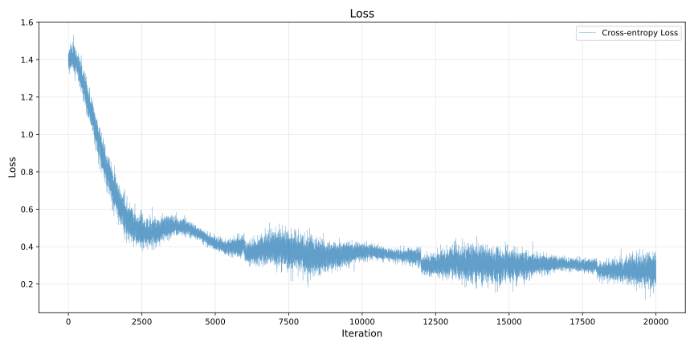

<details>

<summary><b>Nhấp vào đây để mở rộng mã Demo suy luận mô hình lớn MKTY</b></summary>

#### Định nghĩa chức năng tải mô hình và sinh văn bản

```python
from transformers import AutoModelForCausalLM, AutoTokenizer

def load_model_and_tokenizer(model_name):
    model = AutoModelForCausalLM.from_pretrained(
        model_name,
        torch_dtype="auto",
        device_map="auto"
    )
    tokenizer = AutoTokenizer.from_pretrained(model_name)
    return model, tokenizer


def generate_response(prompt, messages, model, tokenizer, max_new_tokens=2000):
    messages.append({"role": "user", "content": prompt})
    text = tokenizer.apply_chat_template(
        messages,
        tokenize=False,
        add_generation_prompt=True
    )
    model_inputs = tokenizer([text], return_tensors="pt").to(model.device)
    generated_ids = model.generate(
        **model_inputs,
        max_new_tokens=max_new_tokens
    )
    generated_ids = [
        output_ids[len(input_ids):] for input_ids, output_ids in zip(model_inputs.input_ids, generated_ids)
    ]
    response = tokenizer.batch_decode(generated_ids, skip_special_tokens=True)[0]
    messages.append({"role": "assistant", "content": response})
    return response

```

#### Chế độ hỏi đáp thông thường

```python
if __name__ == "__main__":
    model_name = r"MKTY-3B-Chat"
    messages = []
    model, tokenizer = load_model_and_tokenizer(model_name)
    while True:
        prompt = input("User> ")
        if prompt == "exit":
            break
        response = generate_response(prompt, messages, model, tokenizer)
        print("MKTY>", response)
```

#### Cơ chế thảo luận mô hình lớn (LLMDM)

```python
if __name__ == "__main__":
    model_name = "MKTY-3B-Chat"
    discuss_rounds = 3
    agent_number = 3
    model, tokenizer = load_model_and_tokenizer(model_name)
    messages_arr = [[] for _ in range(agent_number)]
    while True:
        prompt = input("User> ")
        if prompt == "exit":
            break
        moderator_opinion = "暂无"
        for i in range(discuss_rounds):
            responses_arr = []
            prompt_per_round = "- 问题：\n" + prompt + "\n - 上轮讨论主持人意见：\n" + moderator_opinion + "\n - 请你结合主持人意见，对上述医疗或医学专业的问题发表详细观点，可以质疑并说明理由。\n"
            for j in range(agent_number):
                messages = messages_arr[j]
                response = generate_response(prompt_per_round, messages, model, tokenizer)
                responses_arr.append(response)
                print(f"第{i + 1}轮讨论，LLM {j + 1}观点>\n", response)
                print("-------------------")
            moderator_prompt = "- 问题：\n" + prompt + "\n\n"
            for res_index in range(len(responses_arr)):
                moderator_prompt = moderator_prompt + f"- LLM {res_index + 1}观点：\n" + responses_arr[res_index] + "\n\n"
            moderator_prompt = moderator_prompt + "对于给定的医疗相关问题，请综合各LLM观点，结合自身知识，得出你自己的判断，尽可能详尽，全部都分析到位，还要充分说明理由。\n"
            moderator_opinion = generate_response(moderator_prompt, [], model, tokenizer)
            print(f"第{i + 1}轮讨论，主持人的意见>\n", moderator_opinion)
            print("-------------------")
            clear_history(messages_arr)

```

</details>

### Phân Tích Chuyên Sâu Về Tác Nhân Thông Minh

&nbsp;&nbsp;&nbsp;&nbsp;Chức năng phân tích chuyên sâu dựa trên cơ chế thảo luận mô hình lớn do tôi tự phát triển, gọi là `LLMDM`. Cơ chế này có ba siêu tham số: số lượng tác nhân, số vòng thảo luận, và ngưỡng hội tụ. Các tác nhân sử dụng cùng một mô hình MKTY-3B-Chat nhưng với ngữ cảnh khác nhau. Trong vòng đầu tiên, nhiều ngữ cảnh được thiết lập để mô phỏng nhiều tác nhân, mỗi tác nhân đưa ra ý kiến riêng, và một "chủ tọa" không có lịch sử hội thoại sẽ tổng kết lại. Từ vòng sau, các tác nhân sử dụng bản tóm tắt trước đó kết hợp câu hỏi gốc để tiếp tục thảo luận. Chu trình này lặp lại cho đến khi đạt số vòng tối đa.

&nbsp;&nbsp;&nbsp;&nbsp;Tiếp đến là quá trình "hội tụ": sử dụng `BigBird` để tính embedding cho đầu ra của mỗi tác nhân trong vòng cuối, sau đó tính khoảng cách trung bình giữa các vector để đo mức độ đồng thuận – tức mức độ hội tụ ngữ nghĩa của cuộc thảo luận, kết quả này sẽ hỗ trợ người dùng đánh giá.

### Mô Hình Dự Đoán Chuỗi Thời Gian Kết Hợp Văn Bản

&nbsp;&nbsp;&nbsp;&nbsp;Hiện nay, các bài toán dự đoán chuỗi thời gian trong nhiều lĩnh vực thường sử dụng `LSTM` hoặc `GRU`. Đến năm 2024, một số nghiên cứu bắt đầu ứng dụng `Transformer` cho bài toán này. Tuy nhiên, hầu hết các phương pháp chưa xem xét việc kết hợp dữ liệu chuỗi thời gian với dữ liệu đa phương thức.

&nbsp;&nbsp;&nbsp;&nbsp;Trong nghiên cứu này, tôi thiết kế một mô hình dự đoán chuỗi thời gian trong y tế dựa trên `GRU` kết hợp với **văn bản y khoa**, với nguyên lý: sử dụng `GRU` để dự đoán sơ bộ, sau đó sử dụng `FFT` để chuyển chuỗi thời gian sang miền tần số, trích xuất đặc trưng biên độ và pha, rồi dùng `BigBird` tạo vector embedding cho mô tả văn bản. Tiếp theo, áp dụng cơ chế **chú ý chéo (cross-attention)** giữa đặc trưng văn bản và đặc trưng tần số để tính trọng số kết hợp, sau đó thực hiện **IFFT** để đưa về chuỗi thời gian, kết hợp với ngưỡng kiểm soát từ tuyến tính hóa, cuối cùng cộng với đầu ra `GRU` để tạo kết quả dự đoán cuối.

&nbsp;&nbsp;&nbsp;&nbsp;Ý tưởng này tận dụng rằng tần số phản ánh toàn bộ đặc tính chuỗi thời gian, trong khi miền thời gian chỉ phản ánh từng thời điểm cục bộ. Ví dụ với điện tâm đồ, mô tả "tim đập nhanh" phản ánh tăng biên độ ở dải tần số cao, điều này được thể hiện tốt qua cơ chế chú ý chéo.

**Sơ Đồ Mô Hình Được Trình Bày Dưới Đây:**

<div style="padding: 10px; text-align:center; background-color: rgb(255,255,255)">
  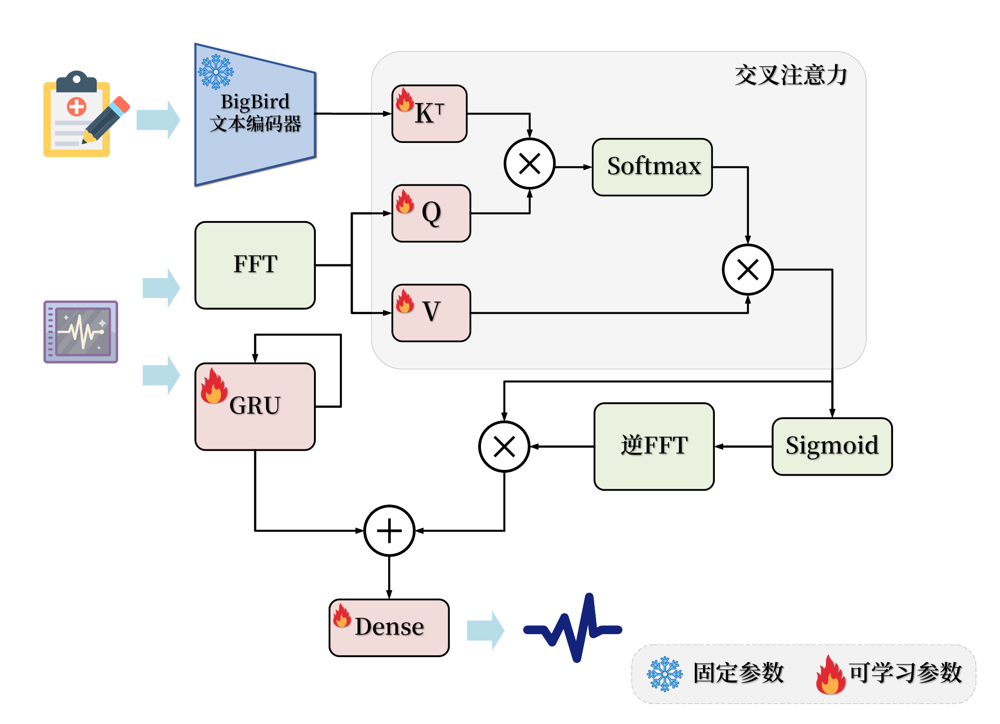
</div>

#### Biểu Diễn Công Thức

<details>

<summary><b>Nhấn để mở phần biểu diễn công thức mô hình</b></summary>

##### 1. Mã Hóa Văn Bản

Đưa văn bản y tế đầu vào $T$ qua bộ mã hóa `BigBird` để thu được đặc trưng văn bản $H_T$:

$H_T = \text{BigBird}(T)$

Tham số của `BigBird` được cố định, không tham gia huấn luyện.

##### 2. Chuyển Đổi Chuỗi Thời Gian Sang Miền Tần Số

Dữ liệu chuỗi thời gian $X$ được biến đổi sang miền tần số bằng FFT:

$X_f = \text{FFT}(X)$

##### 3. Trích Xuất Đặc Trưng Thời Gian

Chuỗi $X$ cũng được đưa qua mạng `GRU` để trích xuất đặc trưng thời gian $H_s$:

$H_s = \text{GRU}(X)$

##### 4. Cơ Chế Chú Ý Chéo

Từ $H_T$ tạo `Query` ($Q$) và `Key` ($K$), từ $X_f$ tạo `Value` ($V$):

$Q = W_Q H_T,\quad K = W_K H_T,\quad V = W_V X_f$

Tính ma trận chú ý:

$A = \text{Softmax}\left(\frac{QK^T}{\sqrt{d_k}}\right)$

Tạo đầu ra chú ý chéo:

$O = A \cdot V$

##### 5. Cơ Chế Cổng

Đầu ra $O$ được đưa qua hàm `Sigmoid` để tạo hệ số cổng $G$:

$G = \text{Sigmoid}(\text{IFFT}(O))$

##### 6. Hợp Nhất Mô Hình

Kết hợp $G$ và đầu ra `GRU` $H_s$ theo dạng có trọng số:

$H_f = G \cdot H_s$

Dự đoán đầu ra cuối cùng:

$\hat{Y} = \text{Dense}(H_f + H_s)$

##### Ký Hiệu

* $T$: Văn bản y tế  
* $X$: Chuỗi thời gian y tế  
* $H_T$: Đặc trưng văn bản  
* $X_f$: Biểu diễn miền tần số của chuỗi  
* $H_s$: Đặc trưng thời gian  
* $Q, K, V$: Thành phần của cơ chế chú ý  
* $A$: Ma trận chú ý  
* $O$: Đầu ra của chú ý chéo  
* $G$: Hệ số cổng  
* $H_f$: Đặc trưng tổng hợp  
* $\hat{Y}$: Dự đoán cuối cùng  
* $W_Q, W_K, W_V$: Ma trận trọng số học được  

</details>

## 🚀 Triển Khai Dự Án

### 1. Cấu Hình Phần Cứng

&nbsp;&nbsp;&nbsp;&nbsp;Hệ thống này là một hệ thống phân tán, khuyến nghị triển khai trên nhiều máy chủ tùy theo yêu cầu hiệu năng. Phía máy chủ backend nghiệp vụ, cơ sở dữ liệu và máy chủ SSR frontend không có yêu cầu đặc biệt. Bộ phận có yêu cầu hiệu năng rõ rệt là lớp dịch vụ thông minh, trong đó MKTY-3B-Chat Mô hình Ngôn ngữ Quy mô Lớn cần tổng cộng 8GB VRAM cho trọng số mô hình và bộ nhớ cache khi suy luận; `BioMedCLIP` yêu cầu 2GB VRAM; `BigBird` cũng yêu cầu 2GB VRAM; mô hình dự đoán chuỗi thời gian thì chiếm dụng VRAM có thể bỏ qua. Hệ thống có thể khởi chạy chỉ với phần backend nghiệp vụ và frontend CSR/SSR, nếu không triển khai hoặc chỉ triển khai một phần lớp dịch vụ thông minh, nhưng các dịch vụ AI tương ứng trong hệ thống sẽ không khả dụng.

### 2. Sao Chép Mã Nguồn và Trọng Số Mô Hình

#### (1) Sao Chép Mã Nguồn

```bash
git clone https://github.com/duyu09/MKTY-System.git
```

#### (2) Tải Về Trọng Số Mô Hình

- **(1) Kho Mô Hình MKTY-3B-Chat Mô Hình Ngôn Ngữ Quy Mô Lớn: `6.19 GB`**

```bash
git lfs install
git clone https://huggingface.co/Duyu/MKTY-3B-Chat
```

- **(2) Kho Mô Hình BioMedCLIP: `790 MB`**

```bash
git lfs install
git clone https://huggingface.co/microsoft/BiomedCLIP-PubMedBERT_256-vit_base_patch16_224
```

- **(3) Kho Mô Hình MarianMT: `1.18 GB`**

&nbsp;&nbsp;&nbsp;&nbsp;Không cần sao chép riêng biệt. Khi mô-đun mô hình nhỏ khởi chạy lần đầu, thư viện `transformers` sẽ tự động tải mô hình từ `Hugging Face` về thư mục bộ nhớ đệm của hệ thống. Khi triển khai, đảm bảo không gian ổ đĩa đủ lớn. Xét tới việc máy chủ có thể nằm trong khu vực Trung Quốc đại lục, các tệp mã liên quan đã thêm câu lệnh thiết lập biến môi trường để chuyển hướng [https://huggingface.co/](https://huggingface.co/) sang máy chủ gương nội địa [https://hf-mirror.com/](https://hf-mirror.com/). Nếu máy chủ của bạn không ở trong phạm vi mạng của Trung Quốc đại lục, hãy xóa các câu lệnh liên quan.

- **(4) Mô Hình Dự Đoán Chuỗi Thời Gian Y Học Tích Hợp Văn Bản MKTY**

Hiện tại chưa mở khóa mô hình tiền huấn luyện. Kích thước trọng số mô hình không vượt quá `10 MB`.

- **(5) Kho Mô Hình BigBird: `2.32 GB`**

```bash
git lfs install
git clone https://huggingface.co/google/bigbird-pegasus-large-pubmed
```

### 3. Thiết Lập Môi Trường

&nbsp;&nbsp;&nbsp;&nbsp;Tùy thuộc vào từng dịch vụ, yêu cầu môi trường cũng khác nhau. Phía backend nghiệp vụ và backend dịch vụ thông minh đều yêu cầu môi trường `Python 3.9+` và hàng đợi thông điệp `RabbitMQ`, trong đó `RabbitMQ` phụ thuộc vào ngôn ngữ `Erlang`. Cách cài đặt `Python` và `RabbitMQ` xin tham khảo [Python chính thức](https://www.python.org/downloads/) và [RabbitMQ chính thức](https://www.rabbitmq.com/download.html). Ngoài ra, khuyến khích tạo môi trường ảo khi triển khai.

#### (1) Backend Nghiệp Vụ

##### Cài Đặt Môi Trường

```bash
pip install -r requirements-rp.txt
```

##### Tệp Mã

`\backend\run.py`, `\backend\util.py`

Lưu ý: thư viện `weasyprint` phụ thuộc vào phần mềm bên ngoài để hoạt động bình thường, các phụ thuộc này thay đổi tùy theo hệ điều hành, vui lòng tham khảo tài liệu mạng tương ứng để giải quyết.

#### (2) Suy Luận Mô Hình Quy Mô Lớn

##### Cài Đặt Môi Trường

```bash
pip install -r requirements-lm.txt
```

Lưu ý: Phiên bản `torch` và `transformers` phụ thuộc vào phần cứng và phiên bản CUDA của bạn, vui lòng tham khảo [PyTorch chính thức](https://pytorch.org/get-started/locally/) để cài đặt phiên bản phù hợp.

##### Tệp Mã

`\backend\large_model.py`, `\backend\large_model_util.py`, cùng với thư mục mô hình MKTY đã sao chép.

#### (3) Suy Luận Mô Hình Quy Mô Nhỏ

##### Cài Đặt Môi Trường

```bash
pip install -r requirements-mm.txt
```

Lưu ý: Phiên bản `torch` và `transformers` phụ thuộc vào phần cứng và phiên bản CUDA của bạn, vui lòng tham khảo [PyTorch chính thức](https://pytorch.org/get-started/locally/) để cài đặt phiên bản phù hợp.

##### Tệp Mã

`\backend\modest_model.py`, `\backend\modest_model_util.py`, cùng với thư mục mô hình BioMedCLIP đã sao chép.

#### (4) Mô hình BigBird và Dự đoán Chuỗi Thời gian

##### Cài đặt Môi trường

```bash
pip install -r requirements-bb.txt
```

##### Tệp Mã nguồn

`\backend\tsbb_model.py`, `\backend\tsbb_model_util.py`.

#### (5) Thiết Lập Cơ Sở Dữ Liệu

&nbsp;&nbsp;&nbsp;&nbsp;Hệ thống này phụ thuộc vào cơ sở dữ liệu `MySQL`, yêu cầu phiên bản `8.0+` để hỗ trợ lưu trữ và truy vấn dữ liệu `JSON`. Vui lòng tham khảo [MySQL chính thức](https://dev.mysql.com/doc/) để cài đặt. Kịch bản SQL định nghĩa dữ liệu (DDL): `\backend\script.sql`, vui lòng thực thi để tạo cơ sở dữ liệu. Dự án này cũng cung cấp dữ liệu mẫu, bạn có thể thực thi kịch bản `backend\demo_data.sql` để nhập dữ liệu mẫu và khởi động dự án một cách nhanh chóng, ví dụ về tên người dùng: `test`, mật khẩu: `123`.

#### (6) Mã Frontend

&nbsp;&nbsp;&nbsp;&nbsp;Frontend của hệ thống sử dụng công cụ đóng gói `Vite` để phát triển, gỡ lỗi và đóng gói. Khuyến nghị sử dụng môi trường `Node v22.12.0+` và trình quản lý gói `yarn`. Tham khảo [Node.js chính thức](https://nodejs.org/) và [Yarn chính thức](https://yarnpkg.com/). Thư mục mã frontend: `\frontend`

#### (7) Hệ Thống Quản Trị Hậu Trường

&nbsp;&nbsp;&nbsp;&nbsp;Hệ thống quản trị hậu trường sử dụng `Python Flask` cho backend, và `Vue` + `Vue-cli` cho frontend. Khuyến nghị sử dụng `Python 3.9+` và `Node v22.12.0+`. Mã frontend của hậu quản trị nằm tại: `\admin_frontend`, mã backend nằm tại: `\admin_backend`.

Cài đặt Phụ thuộc cho Giao diện Quản trị:

```bash
cd \admin_frontend
yarn install
```

Cài đặt Phụ thuộc cho Hệ thống Quản trị:

```bash
pip install -r requirements-admin.txt
```

### 4. Triển Khai và Chạy

Sau khi triển khai mã nguồn, mô hình và tất cả các môi trường/phụ thuộc, **vui lòng chỉnh sửa các biến toàn cục trong mã theo tình hình cụ thể của bạn**, bao gồm đường dẫn mô hình, thông tin kết nối cơ sở dữ liệu, v.v. Các mục cấu hình nằm ở đầu các tệp: `run.py`, `modest_model.py`, `large_model.py`. Trước khi khởi động, đảm bảo rằng dịch vụ MySQL và RabbitMQ đều đang chạy bình thường.

#### (1) Backend Nghiệp Vụ

```bash
python \backend\run.py
```

#### (2) Suy Luận Mô Hình Quy Mô Lớn

```bash
python \backend\large_model.py
```

#### (3) Suy Luận Mô Hình Quy Mô Nhỏ

```bash
python \backend\modest_model.py
```

#### (4) Mã Frontend

Trong `\frontend\src\api\api.js`, phần đầu có cấu hình API của backend nghiệp vụ, hãy sửa đổi phù hợp trước khi khởi chạy hoặc đóng gói.

```bash
cd \frontend
yarn install  # Khởi tạo
yarn dev  # Chạy máy chủ phát triển
yarn build  # Đóng gói
```

Gói sau khi đóng có thể triển khai bằng nhiều phương pháp, ví dụ dùng máy chủ proxy ngược `Nginx`, tham khảo [Tài liệu chính thức của Nginx](https://nginx.org/en/docs/). Cũng có thể chạy trực tiếp bằng Python:

```bash
cd dist
python -m http.server 8092
```

## 💻 Giao Diện Người Dùng Của Hệ Thống

Bảng dưới đây hiển thị một số ảnh chụp màn hình UI frontend của hệ thống. Vui lòng phóng to ảnh để xem chi tiết.

|                                                                   |                                                                                   |                                                                                         |                                                                                         |
| ----------------------------------------------------------------- | --------------------------------------------------------------------------------- | --------------------------------------------------------------------------------------- | --------------------------------------------------------------------------------------- |
| 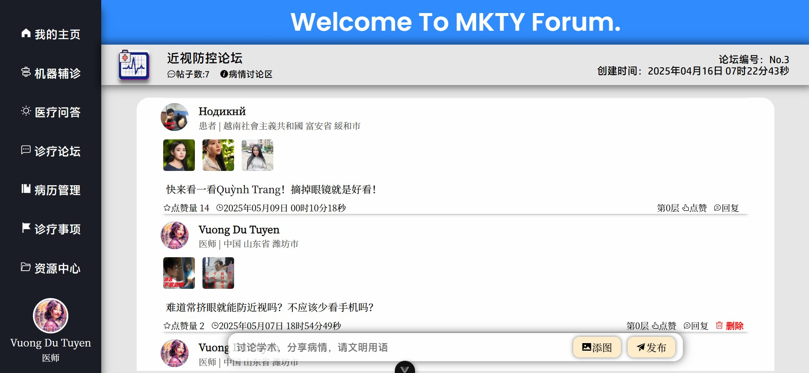         | 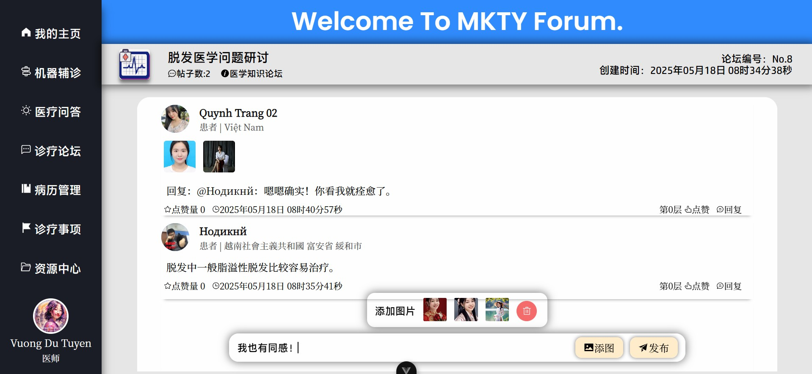                         | 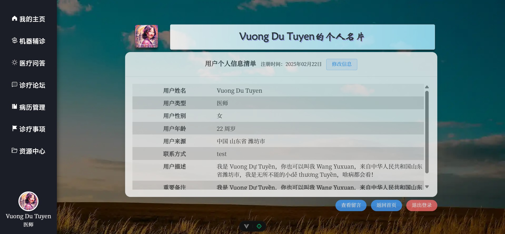                               | 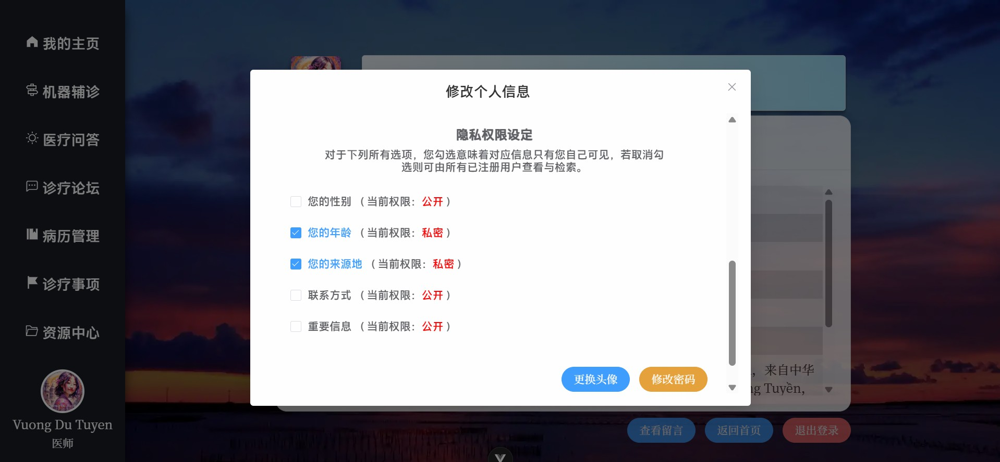                         |
| 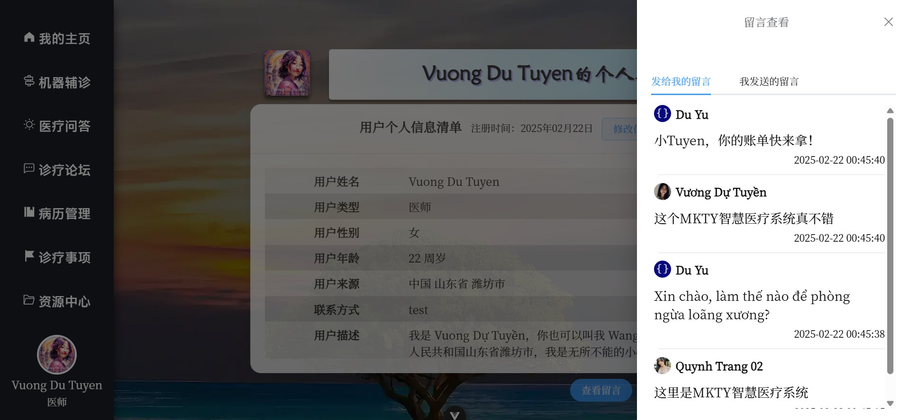   | 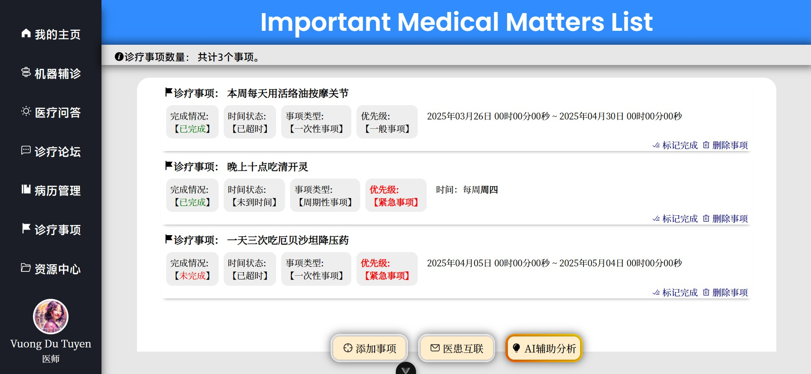                 | 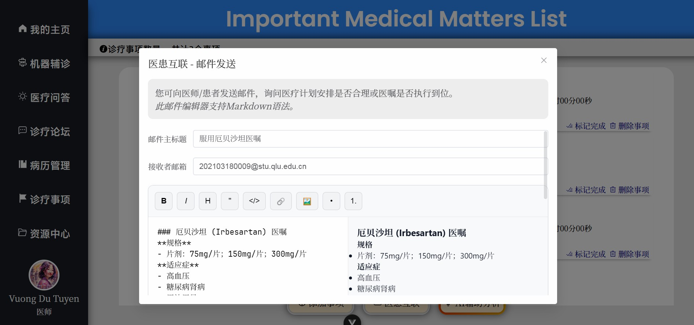                 | 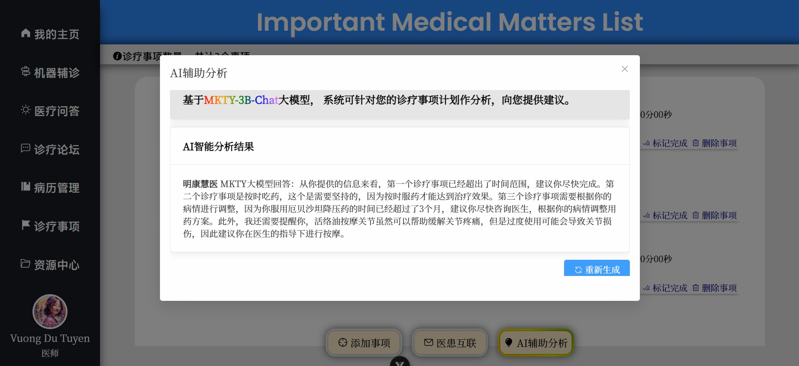                 |
| 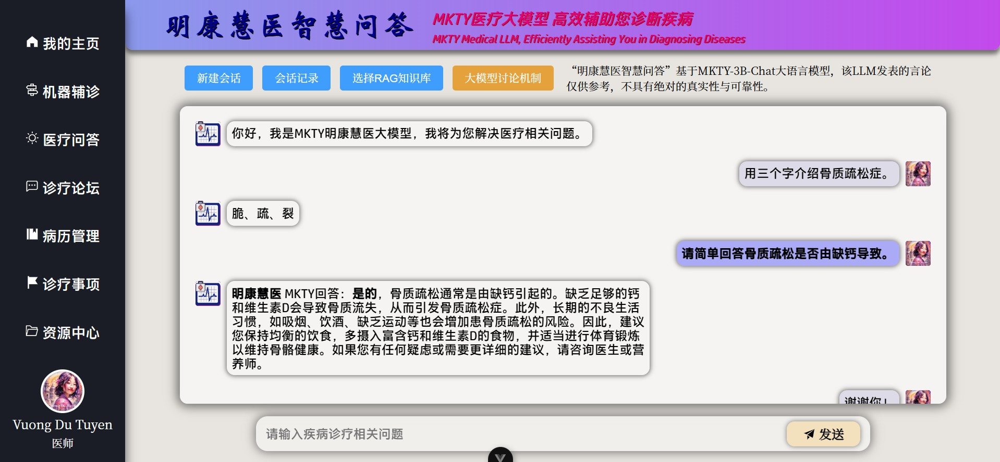       | 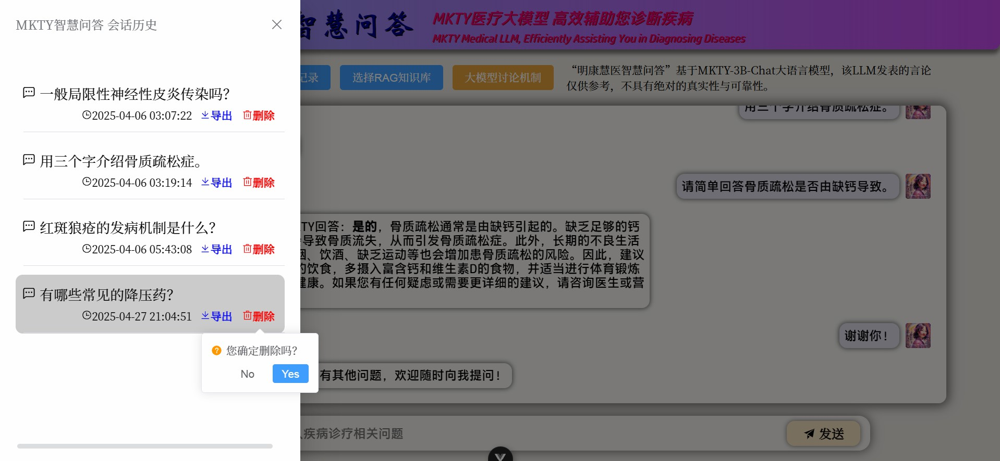                 | 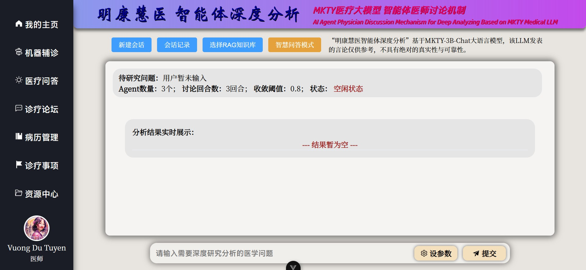                       | 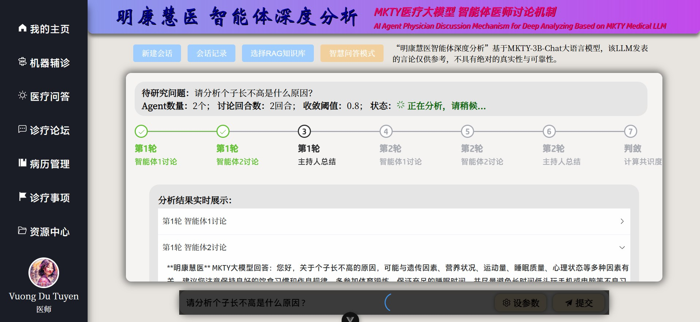                       |
| 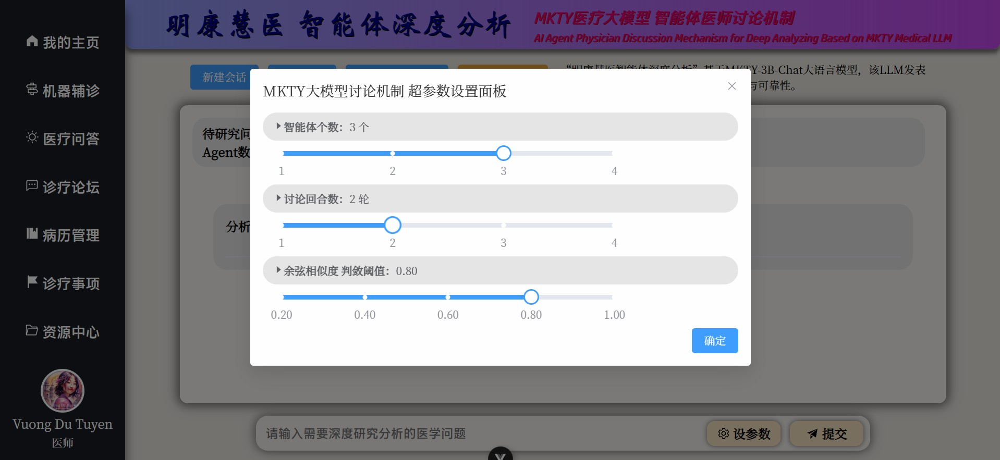 | 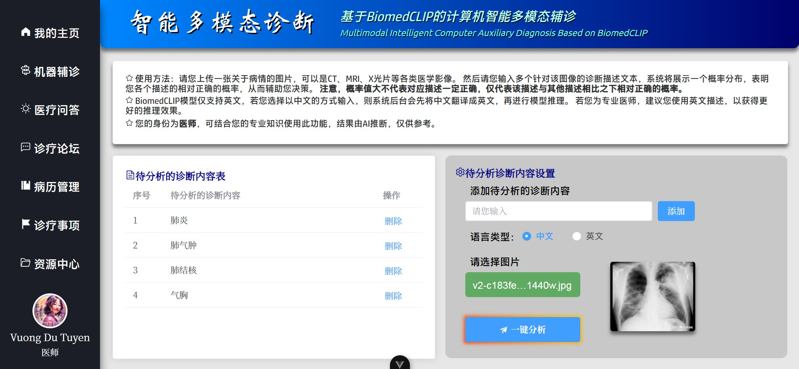 | 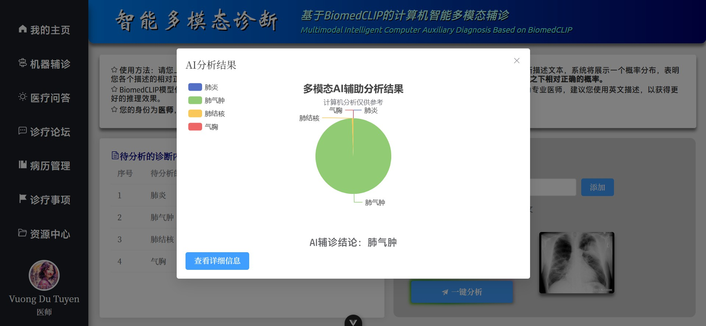 | 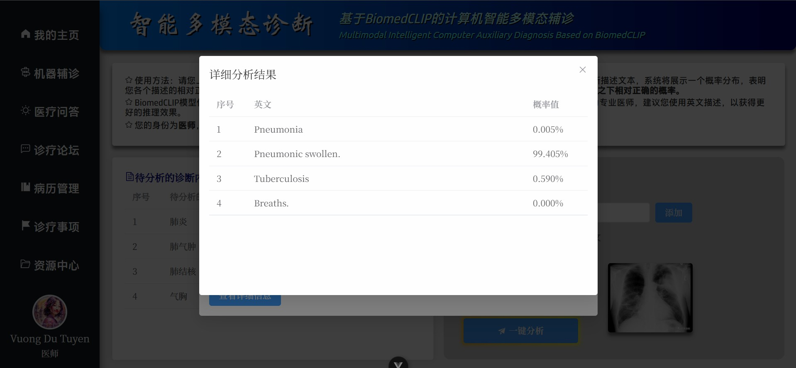 |
| 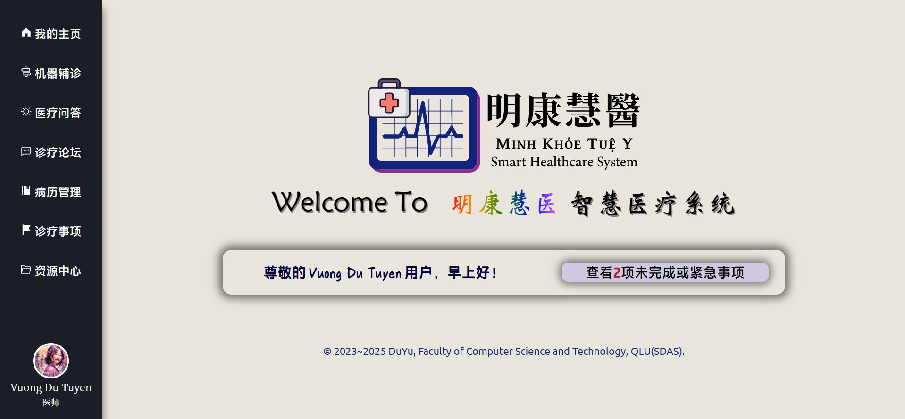 | 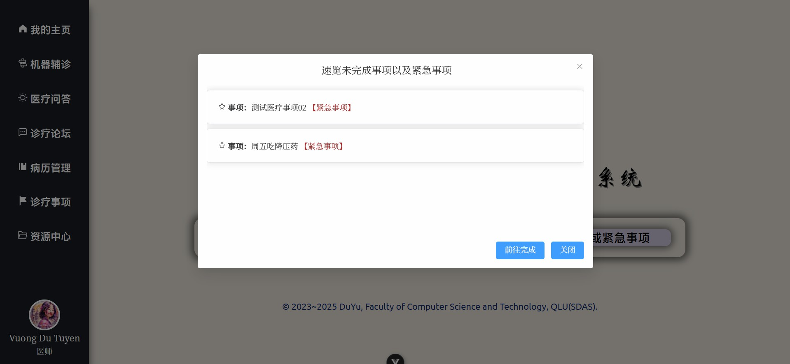           |                                                                                         |                                                                                         |

## 🎓 Tác Giả Dự Án và Tuyên Bố Bản Quyền

Dự án này là đồ án tốt nghiệp của tôi tại Đại học Công nghiệp Tề Lỗ (_Qilu_) (Viện Khoa học tỉnh Sơn Đông) năm 2025.

### 👤 **Tác Giả Dự Án**

- **Đỗ Vũ** (Tiếng Trung Giản Thể: _杜宇_; Tiếng Anh: _Du Yu_; Email: <202103180009@stu.qlu.edu.cn> và <qluduyu09@163.com>), sinh viên tốt nghiệp năm 2025, Học bộ Khoa học và Kỹ thuật Máy tính, Đại học Công nghiệp Tề Lỗ (_Qilu_) (Viện Khoa học tỉnh Sơn Đông).

### 🏫 **Giáo Viên Hướng Dẫn Đồ Án**

- Giáo viên trường: **Khương Văn Phong** (Tiếng Trung Giản Thể: _姜文峰_; Tiếng Anh: _Jiang Wenfeng_), Phó giáo sư Học bộ Khoa học và Kỹ thuật Máy tính, Đại học Công nghiệp Tề Lỗ (_Qilu_) (Viện Khoa học tỉnh Sơn Đông).
- Giáo viên xí nghiệp: **Lý Quân** (Tiếng Trung Giản Thể: _李君_; Tiếng Anh: _Li Jun_), Kỹ sư Phần mềm Cao cấp, Học viện Thực huấn Phần mềm Sư Sáng Sơn Đông, Tập đoàn Khoa kỹ Giáo dục Ambow (_An Bác_, [NYSE: AMBO](https://www.nyse.com/quote/XASE:AMBO)).


<details>

<summary><b>Chữ Nghệ Thuật Của Hệ Thống Minh Khỏe Tuệ Y</b></summary>

```
██\      ██\     ██\   ██\   ████████\  ██\     ██\
███\    ███ |    ██ | ██  |  \__██  __| \██\   ██  |
████\  ████ |    ██ |██  /      ██ |     \██\ ██  /
██\██\██ ██ |    █████  /       ██ |      \████  /
██ \███  ██ |    ██  ██<        ██ |       \██  /
██ |\█  /██ |    ██ |\██\       ██ |        ██ |
██ | \_/ ██ |██\ ██ | \██\ ██\  ██ |██\     ██ |██\
\__|     \__|\__|\__|  \__|\__| \__|\__|    \__|\__|
```

</details>

### ⚖️ Giấy Phép Mã Nguồn Mở

&nbsp;&nbsp;&nbsp;&nbsp;Hệ thống này được công bố công khai theo giấy phép mã nguồn mở **MPL-2.0 (Mozilla Public License 2.0)** **kèm theo các điều khoản bổ sung**, vui lòng đọc kỹ và hiểu rõ đầy đủ nội dung trong tệp [LICENSE](./LICENSE) trước khi tải xuống, sử dụng, chỉnh sửa hoặc phát hành dự án phần mềm này hoặc mã nguồn của nó.

<details>

<summary><b>Nhấp Vào Đây Để Mở Rộng Các Điều Khoản Bổ Sung</b></summary>

-----

Nội dung các điều khoản bổ sung dưới đây được dịch từ phần cuối tiếng Anh của tệp `LICENSE`. Bản dịch tiếng Việt dưới đây chỉ mang tính chất tham khảo.

#### Các Điều Khoản Bổ Sung

##### Điều 1

Nếu bất kỳ phần nào của mã nguồn này (dù đã sửa đổi hay chưa) được sử dụng trong dự án khác, thì các tệp liên quan phải được công bố theo giấy phép `MPL-2.0` hoặc giấy phép tương thích.

##### Điều 2

Phải tuyên bố rõ ràng việc sử dụng phần mềm này trong tài liệu sản phẩm, `README` hoặc trang giới thiệu, bao gồm các nội dung sau:

- Tên của dự án này;
- Liên kết đến kho chính thức;
- Tên thật hoặc bút danh của tác giả gốc.

##### Điều 3

Không được che giấu, xóa bỏ hoặc làm mờ sự thật rằng phần mềm này là mã nguồn mở và được sử dụng trong dự án.

##### Điều 4

Yêu Cầu Đa Ngôn Ngữ Về Ghi Chú Thông Tin Bản Quyền

Nhằm đảm bảo thông tin bản quyền và tác giả được ghi chú một cách minh bạch và chính xác, trừ khi thuộc trường hợp miễn trừ tại Điều `4.3`, phải tuân thủ các yêu cầu đa ngôn ngữ sau:

##### 4.1 Phạm Vi Ghi Chú

Khi hiển thị thông tin bản quyền, phải đồng thời sử dụng ít nhất hai ngôn ngữ như sau (trừ khi thuộc điều kiện miễn trừ tại Điều `4.3`):

- ① Ít nhất một ngôn ngữ chính thức đang có hiệu lực tại quốc gia của người sử dụng (nếu quốc gia đó không có ngôn ngữ chính thức, thì sử dụng ngôn ngữ phổ thông thực tế của quốc gia đó);
- ② Ít nhất một trong các ngôn ngữ sau: Tiếng Trung (Giản thể/Phồn thể), Tiếng Anh hoặc Tiếng Việt.

##### 4.2 Quy Tắc Dịch Thuật Danh Từ Riêng

Đối với các danh từ riêng liên quan đến dự án (bao gồm tên người, tổ chức, tác phẩm...), cần ưu tiên sử dụng bản dịch chuẩn bằng Hán/Anh/Việt được cung cấp trong tài liệu README của dự án này. Nếu cần dịch sang ngôn ngữ khác, phải tuân theo thứ tự ưu tiên sau:

- ① Quy định pháp lý bắt buộc của quốc gia sử dụng ngôn ngữ mục tiêu;
- ② Quy chuẩn của Tổ chức Tiêu chuẩn hóa Quốc tế (ISO);
- ③ Tập quán quốc tế trong lĩnh vực ngoại giao.

##### 4.3 Miễn Trừ Về Số Lượng Ngôn Ngữ

Miễn trừ yêu cầu đa ngôn ngữ trong các trường hợp sau:

- Ngôn ngữ chính thức/phổ thông của quốc gia người sử dụng vốn đã là một trong các ngôn ngữ: Tiếng Trung (Giản thể/Phồn thể), Tiếng Anh hoặc Tiếng Việt;
- Pháp luật tại khu vực sử dụng có yêu cầu nghiêm ngặt hơn về việc ghi chú.

##### 4.4 Hậu Quả Khi Vi Phạm

Hành vi không thực hiện việc ghi chú theo quy định sẽ bị xem là hành vi cố ý che giấu hoặc làm mờ:

- Sự thật rằng phần mềm này là mã nguồn mở;
- Việc dự án mã nguồn mở này đã thực sự được sử dụng trong sản phẩm có liên quan.

-----

</details>

#### Giải Thích

1. Một lần nữa nhấn mạnh, vui lòng nghiêm túc tuân thủ các quy định trong tệp `LICENSE` (MPL-2.0 cùng các điều khoản bổ sung), **tôi hoàn toàn không khoan nhượng đối với bất kỳ hành vi vi phạm bản quyền nào.** Tôi hoàn toàn ủng hộ và hoan nghênh việc sử dụng dự án và mã nguồn này, nhưng đối với mọi hành vi vi phạm giấy phép, tôi sẽ kiên quyết truy cứu trách nhiệm pháp lý và yêu cầu xử lý nghiêm minh nhất trong phạm vi pháp luật cho phép (xử phạt tối đa).

2. Cảnh báo về rủi ro vi phạm bản quyền: Việc sử dụng toàn bộ hoặc một phần dự án này để kinh doanh sản phẩm (bao gồm nhưng không giới hạn trong các hình thức như “thiết kế khóa học”, “đồ án tốt nghiệp” v.v.) không bị giấy phép `MPL-2.0` và các điều khoản bổ sung cấm đoán một cách rõ ràng, **nhưng** phải ghi chú rõ ràng và nổi bật tên dự án này (ít nhất bao gồm tên viết tắt **Minh Khỏe Tuệ Y**), tên tác giả gốc (ít nhất bao gồm **Đỗ Vũ**), và liên kết đến kho mã nguồn chính thức ([https://github.com/duyu09/MKTY-System](https://github.com/duyu09/MKTY-System)). Nếu không có các thông tin này sẽ bị nghi ngờ là đang **cố ý che giấu hoặc làm mờ sự thật rằng phần mềm này là mã nguồn mở và đã được sử dụng trong dự án.**

3. Nếu bạn phát hiện bất kỳ cá nhân hoặc tổ chức nào vi phạm giấy phép mã nguồn mở và các quy định nêu trên, hoan nghênh báo cáo thông qua nhiều hình thức, bao gồm nhưng không giới hạn ở việc gửi email cho bất kỳ tác giả nào của dự án này, hoặc tạo issue trên nền tảng mã nguồn mở nơi dự án được lưu trữ.

## 🔗 Liên Kết Đối Tác

&nbsp;

- Đại học Công nghiệp Tề Lỗ (_Qilu_) (Viện Khoa học tỉnh Sơn Đông): [https://www.qlu.edu.cn/](https://www.qlu.edu.cn/)
  
- Trung tâm Tính toán tỉnh Sơn Đông (Trung tâm Tính toán Siêu máy tính Quốc gia Tế Nam, _NSCCJN_): [https://www.nsccjn.cn/](https://www.nsccjn.cn/)

- Học bộ Khoa học và Kỹ thuật Máy tính, Đại học Công nghiệp Tề Lỗ (_Qilu_) (Viện Khoa học tỉnh Sơn Đông): [http://jsxb.scsc.cn/](http://jsxb.scsc.cn/)

- Trang GitHub của Đỗ Vũ: [https://github.com/duyu09/](https://github.com/duyu09/)

- Trang chủ của Đỗ Vũ tại nhóm nghiên cứu: [https://faculty.lzjtu.edu.cn/chenmei/zh_CN/xsxx/2554/content/1837.htm](https://faculty.lzjtu.edu.cn/chenmei/zh_CN/xsxx/2554/content/1837.htm)

------

### **GIỮ VỮNG TÂM ĐẦU, KIÊN ĐỊNH CHÍ HƯỚNG**

### **𡨹  凭  心  頭   堅  定  志  向**


