<p align="center">
  <br>
  
  
</p>
<br>

# Minh Khoe Tue Y Smart Healthcare System

## 🌍 Documentation Language

<p style="display: flex;align-items: center;">
   
  &nbsp;<a href="./README.md"><b>Chinese Simplified (简体中文)</b></a>&nbsp;|&nbsp;
   
  &nbsp;<a href="./README_EN.md"><b>English</b></a>&nbsp;|&nbsp;
   
  &nbsp;<a href="./README_VN.md"><b>Vietnamese (Tiếng Việt)</b></a>
</p>

> Please note that both the English and Vietnamese versions of this document are LLM-translated from the original Chinese version. While manually proofread, inconsistencies may exist. In case of any discrepancies, the Chinese version shall prevail.

**Full Project Title:** Minh Khoe Tue Y (_Chinese Simplified: 明康慧医_; _Vietnamese: Minh Khỏe Tuệ Y_; _Nom Script: 明劸慧醫_ ) — Design and Implementation of a Health Management and Diagnostic Assistance System Based on LLMs and Multimodal Artificial Intelligence
**Abbreviation:** MKTY Smart Healthcare System

## 📖 Project Overview

This project overview is based on the "Abstract" section of the associated undergraduate thesis paper:

&nbsp;&nbsp;&nbsp;&nbsp;Driven by the further proliferation of Internet applications and the rapid advancement of artificial intelligence technologies, the application of computer technology in the healthcare domain has become increasingly extensive. Growing public demand for healthcare services can no longer be met by traditional diagnosis and healthcare management models. Issues such as low diagnostic efficiency, uneven medical resource allocation, patient inconvenience, and reliance on experience-based decision-making are becoming increasingly pronounced. Therefore, how to leverage Internet technologies and cutting-edge AI—particularly large language models (LLMs) and multimodal technologies—to enhance the digitalization and intelligence of healthcare services has become an important research question.

&nbsp;&nbsp;&nbsp;&nbsp;To explore the potential of Internet and AI technologies, especially LLMs and multimodal AI, in the healthcare domain, this research presents the design and implementation of **Minh Khoe Tue Y (MKTY)**—a health management and diagnostic assistance system based on LLMs and multimodal Artificial Intelligence. This work also represents the author’s contribution as an undergraduate student toward improving doctor-patient communication and optimizing diagnostic workflows.

&nbsp;&nbsp;&nbsp;&nbsp;The MKTY platform is a distributed system that integrates nine core modules: **User Registration & Login, Personal Information Management, Multimodal Intelligent Diagnosis Assistance, Medical Q&A, Diagnostic Forum, Medical Record Management, Diagnostic Checklist Management, Resource Center, and Administrative Backend**. The overall architecture adopts a frontend-backend decoupled design. The backend business logic layer is built using the `Python Flask` framework, the database uses `MySQL`, and asynchronous messaging between the business logic and AI services is implemented using `RabbitMQ`, enabling distributed microservice deployment. The frontend utilizes `Vue3`, `axios`, and `Element Plus` for component-based UI and interactive features. System authentication is ensured via JWT to safeguard data security.

&nbsp;&nbsp;&nbsp;&nbsp;On the AI service side, the “Multimodal Intelligent Diagnosis Assistance” module is based on a cascaded architecture integrating the `BioMedCLIP` contrastive learning model and `MarianMTModel` neural machine translation model for Chinese-English translation. By analyzing medical images, it computes the relative probabilities of multiple diagnostic descriptions in Chinese. The Medical Q&A, in-depth question analysis, and other natural language generation tasks are powered by the `MKTY-3B-Chat` large language model, fine-tuned on extensive medical texts using `LLaMA-Factory` and based on `Qwen2.5-3B-Instruct`. The “In-depth Question Analysis” module adopts a novel LLM generation paradigm self-developed by the author—termed the “Discussion Mechanism”—which deeply mines and guides the reasoning capabilities of the LLM.

&nbsp;&nbsp;&nbsp;&nbsp;The full design and implementation process of the MKTY system is thoroughly presented in this thesis. The study begins by clarifying the industry background and rationale behind the chosen technology stack, then proceeds to analyze technical feasibility, core functional requirements, and implementation strategies in a layered fashion. The working principles and technical highlights of each module are discussed in detail, and system performance was comprehensively tested. The author concludes by summarizing achievements and proposing directions for future improvement. This project represents an exploratory endeavor in digital healthcare. If it can spark student interest in AI for healthcare and encourage broader participation in this field, that would be the greatest value of this research.

**Keywords:** `Digital Healthcare`; `Diagnostic Assistance`; `Large Language Model (LLM)`; `Multimodal AI`; `Vue3`; `Python Flask`

**The diagram below illustrates the system architecture:**

<div style="padding: 15px; text-align:center;">
  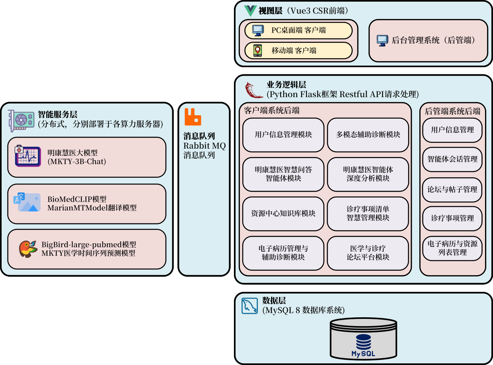
</div><br>

**The following diagram shows the system’s functional modules:**

<div style="padding: 15px; text-align:center; background-color: rgb(255,255,255)">
  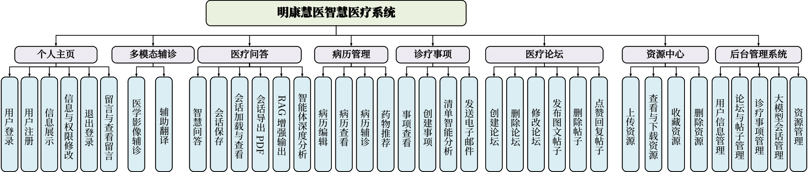
</div><br>

## 🛠️ Technology Stack

This project utilizes the following libraries, components, and open-source technologies:

- **Frontend:** Vue.js, Element Plus, Axios, marked.js, DOMPurify, highlight.js, jQuery  
- **Backend:** Python Flask, pika, weasyprint, smtplib, PIL, argon2, rich, SQLAlchemy  
- **Database:** MySQL  
- **Message Queue:** RabbitMQ  
- **Machine Learning & LLMs:** PyTorch, Transformers, Qwen2.5-3B-Instruct

## 🤖 Artificial Intelligence Technologies

### MKTY-3B-Chat Large-scale Language Model

> Public model weights available at:
> [https://huggingface.co/Duyu/MKTY-3B-Chat](https://huggingface.co/Duyu/MKTY-3B-Chat)

&nbsp;&nbsp;&nbsp;&nbsp;**The MKTY-3B-Chat Large-scale Language Model** (Chinese Simplified: _明康慧医大模型_; Vietnamese: _MKTY-3B-Chat Mô hình Ngôn ngữ Quy mô Lớn_) is a core component of this project and was developed as the undergraduate capstone project for the Faculty of Computer Science and Technology, Grade 2025, at Qilu University of Technology (Shandong Academy of Sciences).

&nbsp;&nbsp;&nbsp;&nbsp;With a parameter size of `3.09B` and quantization precision of `BF16`, the model has been fine-tuned and optimized specifically for domains such as medicine, healthcare, and biology, demonstrating superior performance compared to its base model, `Qwen2.5-3B-Instruct` (Chinese Simplified: _通义千问_). Fine-tuning was conducted using the LoRA (Low-Rank Adaptation) algorithm, focusing exclusively on Chinese language tasks. The process involved both incremental pretraining and supervised fine-tuning (SFT), implemented in two alternating rounds (i.e., one round of pretraining followed by one round of SFT, repeated once more). This design addresses the limitation of small-scale base models in absorbing domain-specific knowledge and mitigates the problem of catastrophic forgetting after a single SFT round.

**Training Data**:
&nbsp;&nbsp;&nbsp;&nbsp;The training corpus includes diverse biomedical texts, diagnostic and Q\&A datasets, medical exam multiple-choice questions, and self-awareness prompts. MKTY’s main application scenarios in this project are: medical Q\&A, in-depth model discussions, treatment plan summarization, and diagnosis and drug recommendation based on medical records. To support these use cases, domain-specific datasets were curated:

* Biomedical texts for incremental pretraining to enhance domain knowledge
* Medical Q\&A datasets for SFT to improve answer quality
* Clinical diagnostic texts to enhance case interpretation
* Medical exam questions to instruct answer format and decision-making patterns
* Self-awareness prompts to embed model identity and provenance knowledge

&nbsp;&nbsp;&nbsp;&nbsp;The total volume of training data is approximately `2.88 GB` compressed (about `6.79 GB` uncompressed). All datasets are open-source and used in compliance with their respective licenses. Due to the high volume and dispersed nature of the data, only major sources are listed below. All data were preprocessed via cleaning and formatting:

| Major Data Sources                                                                                                             |
| ------------------------------------------------------------------------------------------------------------------------------ |
| [https://huggingface.co/datasets/Flmc/DISC-Med-SFT/tree/main](https://huggingface.co/datasets/Flmc/DISC-Med-SFT/tree/main)     |
| [https://huggingface.co/datasets/Bolin97/MedicalQA/tree/main](https://huggingface.co/datasets/Bolin97/MedicalQA/tree/main)     |
| [https://huggingface.co/datasets/tyang816/MedChatZH/tree/main](https://huggingface.co/datasets/tyang816/MedChatZH/tree/main)   |
| [https://huggingface.co/datasets/TigerResearch/MedCT/tree/main](https://huggingface.co/datasets/TigerResearch/MedCT/tree/main) |
| [https://huggingface.co/datasets/hajhouj/med\_qa/tree/main](https://huggingface.co/datasets/hajhouj/med_qa/tree/main)          |
| [https://huggingface.co/datasets/ChenWeiLi/Medtext\_zhtw](https://huggingface.co/datasets/ChenWeiLi/Medtext_zhtw)              |
| Other datasets (omitted)                                                                                                       |

&nbsp;&nbsp;&nbsp;&nbsp;Special thanks are extended to the providers of the above datasets. Below is a loss curve illustrating the model’s cross-entropy reduction during incremental training. A total of 3+ epochs were run, covering 20,000 training steps over 6,000 batches per epoch:

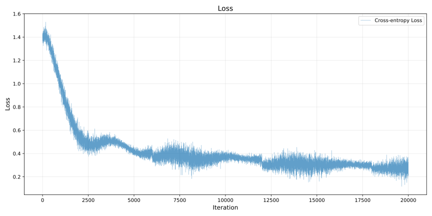

<details>

<summary><b>Click here to expand the MKTY large model inference demo code</b></summary>

#### Model Loading and Text Generation Function Definition

```python
from transformers import AutoModelForCausalLM, AutoTokenizer

def load_model_and_tokenizer(model_name):
    model = AutoModelForCausalLM.from_pretrained(
        model_name,
        torch_dtype="auto",
        device_map="auto"
    )
    tokenizer = AutoTokenizer.from_pretrained(model_name)
    return model, tokenizer


def generate_response(prompt, messages, model, tokenizer, max_new_tokens=2000):
    messages.append({"role": "user", "content": prompt})
    text = tokenizer.apply_chat_template(
        messages,
        tokenize=False,
        add_generation_prompt=True
    )
    model_inputs = tokenizer([text], return_tensors="pt").to(model.device)
    generated_ids = model.generate(
        **model_inputs,
        max_new_tokens=max_new_tokens
    )
    generated_ids = [
        output_ids[len(input_ids):] for input_ids, output_ids in zip(model_inputs.input_ids, generated_ids)
    ]
    response = tokenizer.batch_decode(generated_ids, skip_special_tokens=True)[0]
    messages.append({"role": "assistant", "content": response})
    return response

```

#### Standard Q&A mode

```python
if __name__ == "__main__":
    model_name = r"MKTY-3B-Chat"
    messages = []
    model, tokenizer = load_model_and_tokenizer(model_name)
    while True:
        prompt = input("User> ")
        if prompt == "exit":
            break
        response = generate_response(prompt, messages, model, tokenizer)
        print("MKTY>", response)
```

#### Large Language Model Discussion Mechanism (LLMDM)

```python
if __name__ == "__main__":
    model_name = "MKTY-3B-Chat"
    discuss_rounds = 3
    agent_number = 3
    model, tokenizer = load_model_and_tokenizer(model_name)
    messages_arr = [[] for _ in range(agent_number)]
    while True:
        prompt = input("User> ")
        if prompt == "exit":
            break
        moderator_opinion = "暂无"
        for i in range(discuss_rounds):
            responses_arr = []
            prompt_per_round = "- 问题：\n" + prompt + "\n - 上轮讨论主持人意见：\n" + moderator_opinion + "\n - 请你结合主持人意见，对上述医疗或医学专业的问题发表详细观点，可以质疑并说明理由。\n"
            for j in range(agent_number):
                messages = messages_arr[j]
                response = generate_response(prompt_per_round, messages, model, tokenizer)
                responses_arr.append(response)
                print(f"第{i + 1}轮讨论，LLM {j + 1}观点>\n", response)
                print("-------------------")
            moderator_prompt = "- 问题：\n" + prompt + "\n\n"
            for res_index in range(len(responses_arr)):
                moderator_prompt = moderator_prompt + f"- LLM {res_index + 1}观点：\n" + responses_arr[res_index] + "\n\n"
            moderator_prompt = moderator_prompt + "对于给定的医疗相关问题，请综合各LLM观点，结合自身知识，得出你自己的判断，尽可能详尽，全部都分析到位，还要充分说明理由。\n"
            moderator_opinion = generate_response(moderator_prompt, [], model, tokenizer)
            print(f"第{i + 1}轮讨论，主持人的意见>\n", moderator_opinion)
            print("-------------------")
            clear_history(messages_arr)

```

</details>

### In-depth Agent Analysis

&nbsp;&nbsp;&nbsp;&nbsp;The "in-depth agent analysis" functionality is based on a custom-designed mechanism known as **Large Language Model Discussion Mechanism** `LLMDM`. It involves three hyperparameters: number of agents, number of discussion rounds, and convergence threshold. Identical models (MKTY-3B-Chat) with different contextual histories are treated as distinct agents.

&nbsp;&nbsp;&nbsp;&nbsp;In the first round, the system creates multiple simulated agents by assigning distinct context arrays to each. Each agent then independently responds to the target question. A "moderator" agent with no prior context synthesizes their responses. In subsequent rounds, the original question is merged with the moderator’s previous summary and redistributed to the agents, who again respond from their updated contexts. This process repeats until a maximum number of rounds is reached.

&nbsp;&nbsp;&nbsp;&nbsp;To assess semantic convergence, `BigBird` is used to embed the final-round outputs into sentence vectors. The mean pairwise distance among these vectors serves as a proxy for consensus—i.e., discussion convergence—which users can interpret qualitatively.

### Time Series Prediction Model with Text Integration

&nbsp;&nbsp;&nbsp;&nbsp;While most recent time series prediction models use `LSTM` or `GRU`, and newer Transformer-based models have emerged in 2024, these models rarely integrate multimodal inputs like text.

&nbsp;&nbsp;&nbsp;&nbsp;In this research, a GRU-based medical time series prediction model was proposed using clinical textual descriptions. The core methodology is as follows:

1. A basic GRU layer performs initial temporal modeling.
2. The frequency domain of historical time series is extracted via FFT, yielding amplitude and phase vectors.
3. Medical text is embedded using `BigBird`, and cross-attention is computed between these embeddings and the frequency-domain vectors.
4. The weighted frequency features are reconstructed using inverse FFT.
5. A threshold vector is computed via a linear layer, and a gating mechanism applies this vector to the reconstructed data.
6. The gated output is added to the GRU baseline output to yield the final prediction.

&nbsp;&nbsp;&nbsp;&nbsp;This design emphasizes the global pattern representation afforded by the frequency domain and its alignment with textual cues. For example, a clinical note stating "increased heart rate" aligns with higher amplitudes in the high-frequency components of an ECG waveform—a correlation that cross-attention can capture but time-domain features alone may not.

**The model architecture is illustrated below:**

<div style="padding: 10px; text-align:center; background-color: rgb(255,255,255)">
  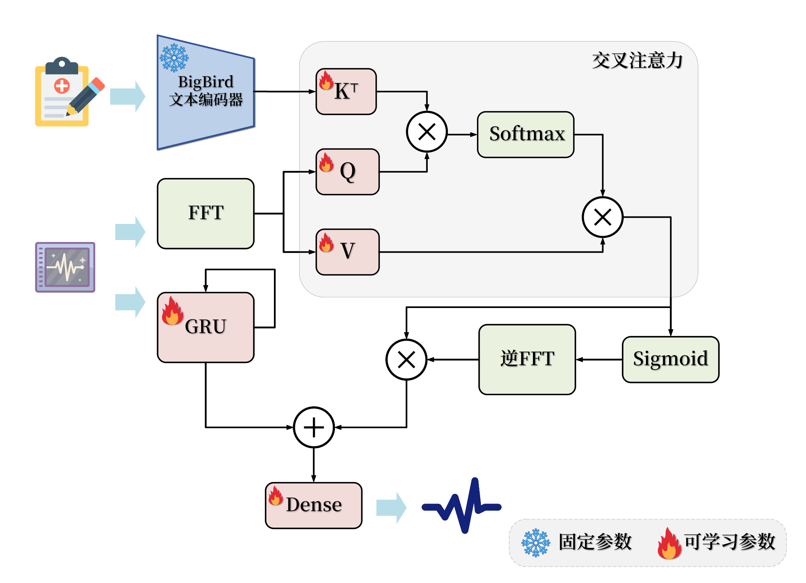
</div>

#### Mathematical Formulation

<details>

<summary><b>Click to expand model formulation</b></summary>

##### 1. Text Encoding

Let medical text input be \$T\$. The pre-trained `BigBird` encoder yields:

$$
H_T = \text{BigBird}(T)
$$

Parameters of `BigBird` are frozen during training.

##### 2. Time Series Frequency Transformation

Given time series input \$X\$, compute its FFT:

$$
X_f = \text{FFT}(X)
$$

##### 3. Temporal Feature Extraction

Time-domain features are extracted via GRU:

$$
H_s = \text{GRU}(X)
$$

##### 4. Cross-Attention Mechanism

From \$H\_T\$, compute Query (\$Q\$) and Key (\$K\$); from \$X\_f\$, compute Value (\$V\$):

$$
Q = W_Q H_T,\quad K = W_K H_T,\quad V = W_V X_f
$$

Attention scores:

$$
A = \text{Softmax}\left(\frac{QK^T}{\sqrt{d_k}}\right)
$$

Cross-attention output:

$$
O = A \cdot V
$$

##### 5. Gating Mechanism

Apply inverse FFT to \$O\$, then pass through a Sigmoid to obtain gating factor \$G\$:

$$
G = \text{Sigmoid}(\text{IFFT}(O))
$$

##### 6. Modality Fusion

Fuse \$G\$ and GRU output \$H\_s\$:

$$
H_f = G \cdot H_s
$$

Final prediction:

$$
\hat{Y} = \text{Dense}(H_f + H_s)
$$

##### Symbol Glossary

* \$T\$: Medical text input
* \$X\$: Medical time series input
* \$H\_T\$: Text embedding features
* \$X\_f\$: Frequency-domain representation of \$X\$
* \$H\_s\$: Time-domain features from GRU
* \$Q\$, \$K\$, \$V\$: Cross-attention query, key, value
* \$A\$: Attention matrix
* \$O\$: Cross-attention output
* \$G\$: Gating factor
* \$H\_f\$: Fused feature representation
* \$\hat{Y}\$: Final prediction
* \$W\_Q\$, \$W\_K\$, \$W\_V\$: Learnable projection matrices

</details>

## 🚀 Project Deployment

### 1. Hardware Requirements

&nbsp;&nbsp;&nbsp;&nbsp;This system is designed as a distributed architecture. It is recommended to deploy across multiple servers depending on performance requirements. The backend for business logic, the database server, and the SSR frontend server do not have specific hardware demands. The most performance-sensitive layer is the intelligent service layer. The Minh Khoe Tue Y large-scale model (MKTY-3B-Chat) requires 8GB of VRAM for weights and inference cache, BioMedCLIP requires 2GB, and BigBird also needs 2GB. The time-series forecasting model consumes negligible VRAM. The system can still be launched without deploying some or all of the AI services; however, only the backend and CSR/SSR frontend components will function, and corresponding AI functionalities will be unavailable.

### 2. Cloning Code and Model Weights

#### (1) Clone Source Code

```bash
git clone https://github.com/duyu09/MKTY-System.git
```

#### (2) Download Model Weights

- **(1) MKTY-3B-Chat Large-scale Language Model**
  Repository size: `6.19 GB`

```bash
git lfs install
git clone https://huggingface.co/Duyu/MKTY-3B-Chat
```

- **(2) BioMedCLIP Model**
  Repository size: `790 MB`

```bash
git lfs install
git clone https://huggingface.co/microsoft/BiomedCLIP-PubMedBERT_256-vit_base_patch16_224
```

- **(3) MarianMT Model**
  Repository size: `1.18 GB`

&nbsp;&nbsp;&nbsp;&nbsp;This repository does not require manual cloning. It will be automatically downloaded by the `transformers` library during the first launch of the small-scale model module. Ensure sufficient disk space for the cache. Considering that servers may be located in Mainland China, environment variables are preset in the relevant scripts to redirect [https://huggingface.co/](https://huggingface.co/) to the mirror site [https://hf-mirror.com/](https://hf-mirror.com/). If your server is outside Mainland China, please remove those lines of code.

- **(4) MKTY Fusion Text Medical Time-Series Prediction Model**

Pretrained weights are not currently available. The model size is under `10 MB`.

- **(5) BigBird Model**
  Repository size: `2.32 GB`

```bash
git lfs install
git clone https://huggingface.co/google/bigbird-pegasus-large-pubmed
```

### 3. Environment Setup

&nbsp;&nbsp;&nbsp;&nbsp;Different components require different environments. Both the business logic backend and intelligent services backend depend on `Python 3.9+` and the `RabbitMQ` message queue, which in turn depends on the `Erlang` environment. Refer to the [Python official site](https://www.python.org/downloads/) and [RabbitMQ official site](https://www.rabbitmq.com/download.html) for installation. It is recommended to use a virtual environment for deployment.

#### (1) Business Logic Backend

##### Dependency Installation

```bash
pip install -r requirements-rp.txt
```

##### Source Files

`\backend\run.py`, `\backend\util.py`.

Note: The `weasyprint` library requires external software for proper operation. Its dependencies vary by operating system. Please consult online resources tailored to your setup.

#### (2) Large-scale Model Inference

##### Dependency Installation

```bash
pip install -r requirements-lm.txt
```

Note: `torch` and `transformers` versions depend on your hardware and CUDA configuration. Refer to the [PyTorch website](https://pytorch.org/get-started/locally/) for suitable installation.

##### Source Files

`\backend\large_model.py`, `\backend\large_model_util.py`, and the MKTY-3B-Chat model directory.

#### (3) Small-scale Model Inference

##### Dependency Installation

```bash
pip install -r requirements-mm.txt
```

Note: Same version considerations apply as with the large model setup.

##### Source Files

`\backend\modest_model.py`, `\backend\modest_model_util.py`, and the BioMedCLIP model directory.

#### (4) BigBird and Time Series Prediction Model

##### Environment Installation

```bash
pip install -r requirements-bb.txt
```

##### Code Files

`\backend\tsbb_model.py`, `\backend\tsbb_model_util.py`.

#### (5) Database Initialization

&nbsp;&nbsp;&nbsp;&nbsp;The system uses a `MySQL` database. Version 8.0+ is required for JSON data support. Refer to the [MySQL official site](https://dev.mysql.com/doc/) for installation instructions. Use the SQL script `\backend\script.sql` to initialize the database schema. This project also provides sample data, you can execute `backend\demo_data.sql` script to import the sample data and start the project quickly, demo username: `test`, password: `123`.

#### (6) Frontend Setup

&nbsp;&nbsp;&nbsp;&nbsp;The frontend is built and run using `Vite` and recommends `Node.js v22.12.0+` and the `yarn` package manager. See the [Node.js website](https://nodejs.org/) and [Yarn website](https://yarnpkg.com/). Frontend source directory: `\frontend`.

#### (7) Admin Panel

&nbsp;&nbsp;&nbsp;&nbsp;The admin panel uses `Python Flask` for the backend and `Vue` + `Vue-cli` for the frontend. Recommended environments are `Python 3.9+` and `Node v22.12.0+`. Admin frontend directory: `\admin_frontend`; Admin backend directory: `\admin_backend`.

Backend Frontend Dependency Installation:

```bash
cd \admin_frontend
yarn install
```

Backend Backend Dependency Installation:

```bash
pip install -r requirements-admin.txt
```

### 4. Running the System

&nbsp;&nbsp;&nbsp;&nbsp;After installing all code, models, dependencies, and environments, **please modify the global configuration variables** (such as model paths and database connection information) based on your specific deployment settings. These configurations are located at the beginning of `run.py`, `modest_model.py`, and `large_model.py`. Ensure that the MySQL database and all RabbitMQ services are operational before starting.

#### (1) Business Logic Backend

```bash
python \backend\run.py
```

#### (2) Large-scale Model Inference

```bash
python \backend\large_model.py
```

#### (3) Small-scale Model Inference

```bash
python \backend\modest_model.py
```

#### (4) Frontend

Modify the API base URL and endpoints at the top of `\frontend\src\api\api.js` before running or building.

```bash
cd \frontend
yarn install  # Initialize
yarn dev  # Start development server
yarn build  # Build for production
```

The built frontend can be deployed via various methods, such as with `Nginx` reverse proxy. See the [Nginx documentation](https://nginx.org/en/docs/). Alternatively, serve it using Python:

```bash
cd dist
python -m http.server 8092
```

## 💻 UI Showcase

The table below presents selected frontend UI displays. Please enlarge images for details.

|                                                                   |                                                                                   |                                                                                         |                                                                                         |
| ----------------------------------------------------------------- | --------------------------------------------------------------------------------- | --------------------------------------------------------------------------------------- | --------------------------------------------------------------------------------------- |
| 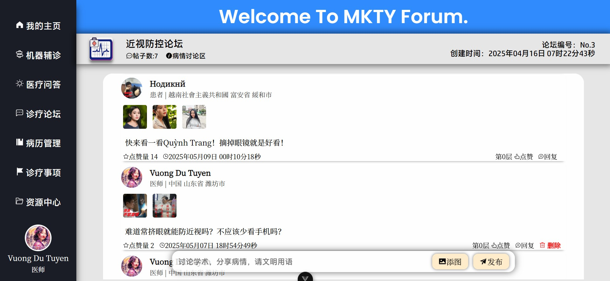         |                          | 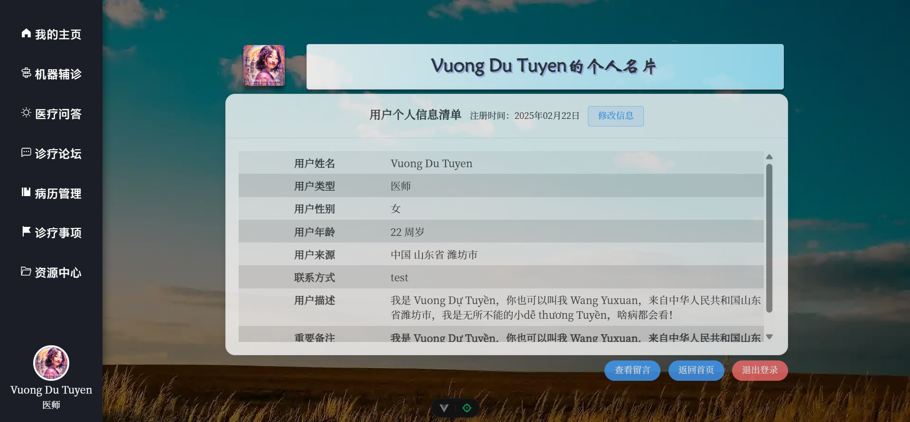                               |                          |
| 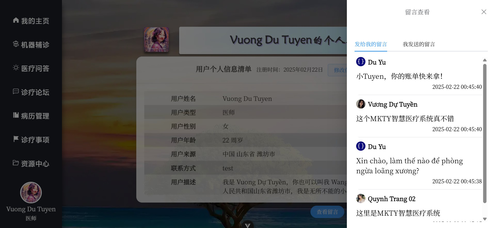   | 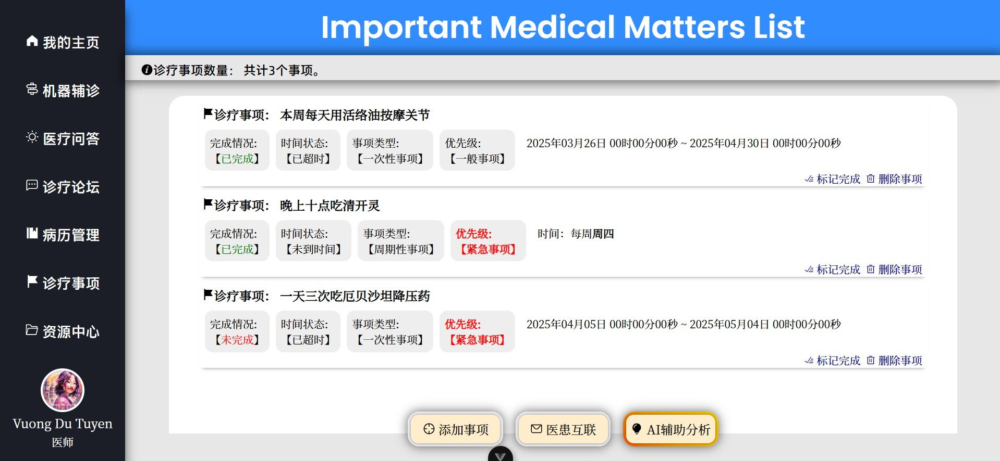                 | 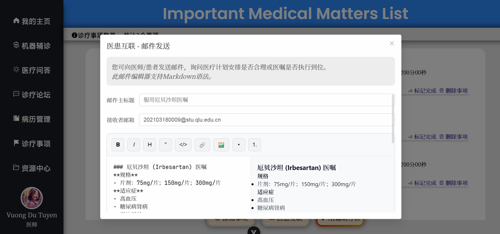                 | 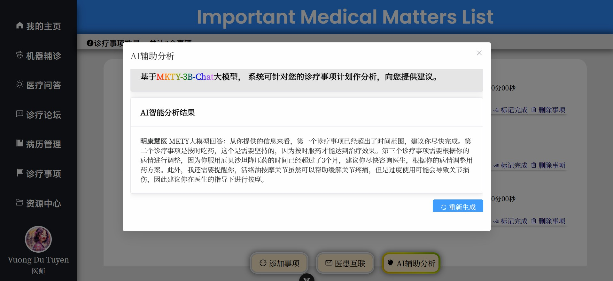                 |
|        | 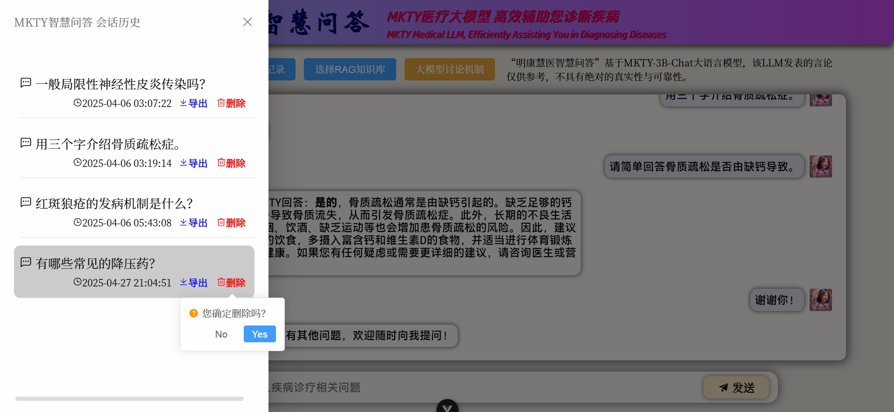                 | 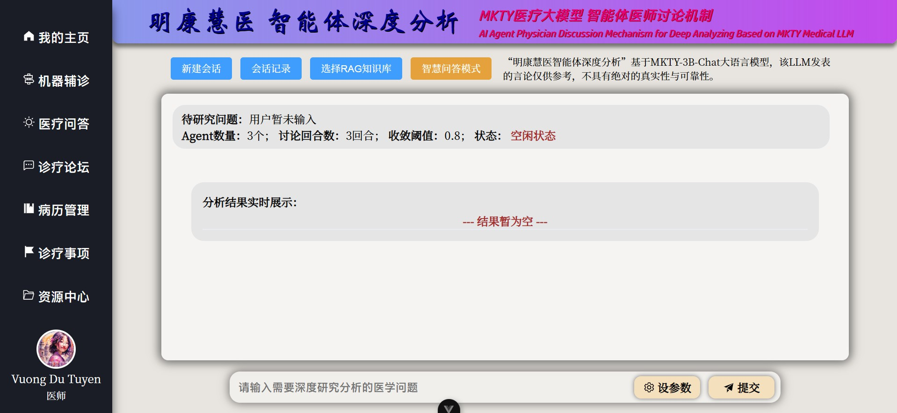                       | 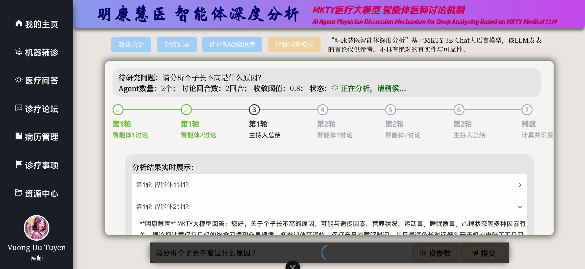                       |
| 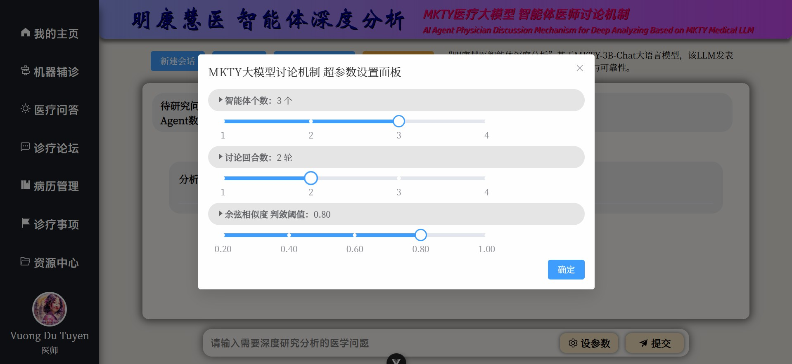 | 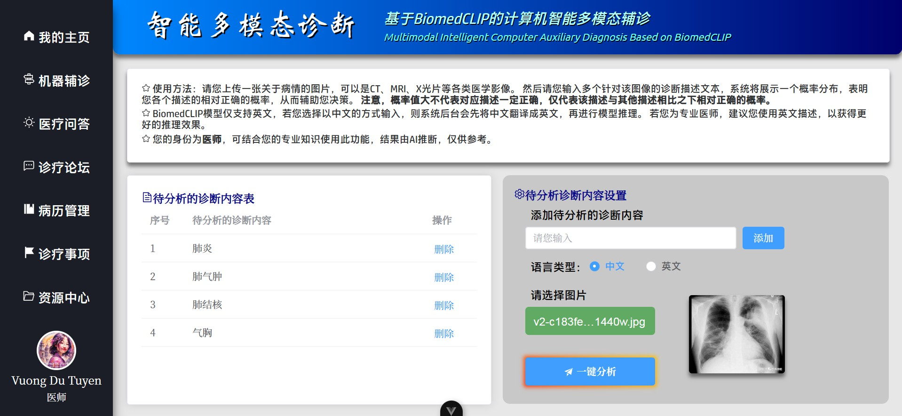 | 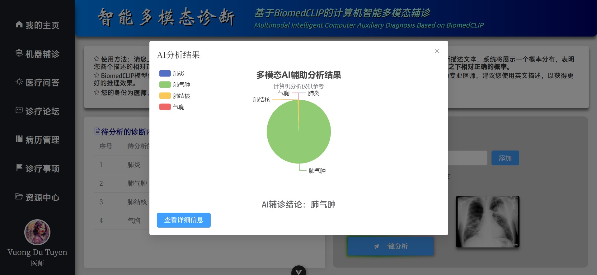 | 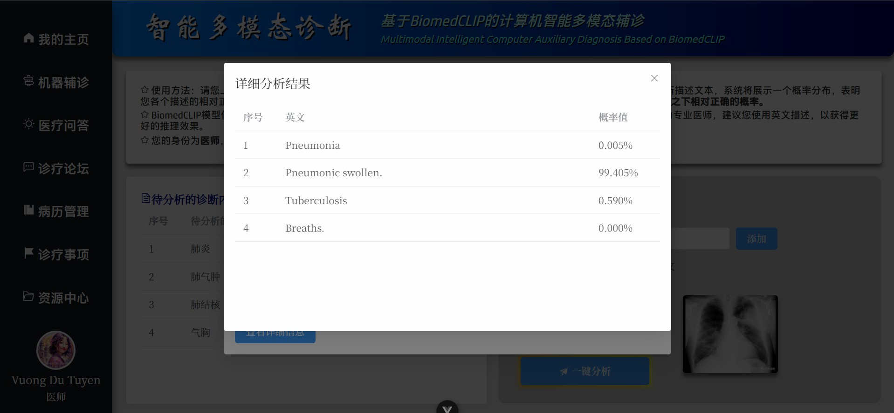 |
| 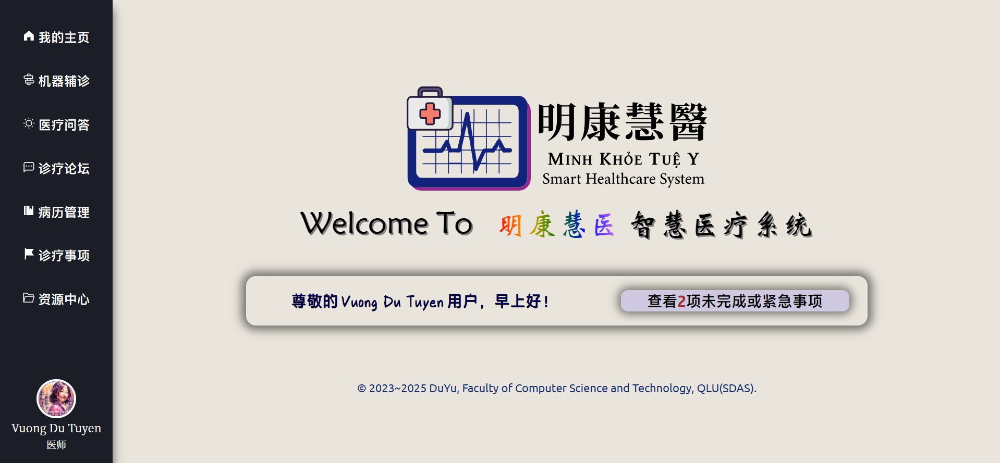 | 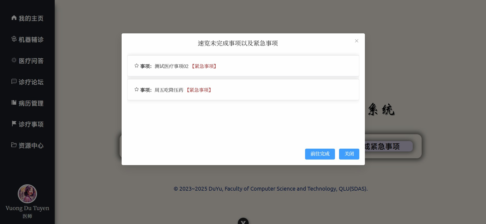           |                                                                                         |                                                                                         |

## 🎓 Project Authors

This project serves as the graduation thesis for the 2025 batch of undergraduate students in the Faculty of Computer Science and Technology, Qilu University of Technology (Shandong Academy of Sciences).

### 👤 Project Author & Copyright Notice

- **Du Yu** (Chinese Simplified: _杜宇_; Vietnamese: _Đỗ Vũ_; Email: <202103180009@stu.qlu.edu.cn> and <qluduyu09@163.com>), undergraduate student at Faculty of Computer Science and Technology, Qilu University of Technology (Shandong Academy of Sciences).

### 🏫 Thesis Advisors

- Academic Mentor: **Jiang Wenfeng** (Chinese Simplified: _姜文峰_; Vietnamese: _Khương Văn Phong_), Associate professor, Faculty of Computer Science and Technology, Qilu University of Technology (Shandong Academy of Sciences)
- Enterprise Mentor: **Li Jun** (Chinese Simplified: _李君_; Vietnamese: _Lý Quân_), Senior software engineer, Shandong Strong (Shichuang) Software Training College, Ambow Education Group ([NYSE: AMBO](https://www.nyse.com/quote/XASE:AMBO))


<details>

<summary><b>Art Typography of Minh Khoe Tue Y System</b></summary>

```
██\      ██\     ██\   ██\   ████████\  ██\     ██\
███\    ███ |    ██ | ██  |  \__██  __| \██\   ██  |
████\  ████ |    ██ |██  /      ██ |     \██\ ██  /
██\██\██ ██ |    █████  /       ██ |      \████  /
██ \███  ██ |    ██  ██<        ██ |       \██  /
██ |\█  /██ |    ██ |\██\       ██ |        ██ |
██ | \_/ ██ |██\ ██ | \██\ ██\  ██ |██\     ██ |██\
\__|     \__|\__|\__|  \__|\__| \__|\__|    \__|\__|
```

</details>

### ⚖️ Open Source License

    This system is publicly released under the **Mozilla Public License 2.0 (MPL-2.0)** with **Additional Terms**. Before downloading, using, modifying, or distributing this software project or its source code, please carefully read and fully understand the content of the [LICENSE](./LICENSE) file.

<details>

<summary><b>Click to expand Additional Terms</b></summary>

---

Additional Terms
----------------

The following Additional Terms are hereby incorporated into this License, in accordance with Section 3.0 of the Mozilla Public License, Version 2.0 (MPL-2.0). These terms apply to all copies and Derivative Works of the Covered Software:

1. **Reciprocal Licensing**
   If any part of this code is used in another project (whether modified or unmodified), the corresponding files must be made open source under the MPL-2.0 or a license compatible with it.

2. **Attribution Requirement**
   You must clearly acknowledge the use of this software in the documentation, README file, or About page of your product. The acknowledgment must include:

   * The name of this project;
   * A link to the official repository;
   * The name or pseudonym of the original author.

3. **Transparency of Open Source Use**
   You may not obfuscate, remove, or conceal the fact that this software is open source and is used in your project.

4. **Multilingual Attribution Requirement**
   To ensure accurate and transparent attribution, the following multilingual requirements apply unless otherwise exempted under Section 4.3:

   4.1 **Language Coverage Requirement**
   Attribution must be provided in both:

   * (i) At least one legally recognized official language of the user's country of nationality (or the de facto common language if no official language exists); and
   * (ii) At least one of: Simplified Chinese, Traditional Chinese, English, or Vietnamese.

   4.2 **Proper Noun Translation Standards**
   For names of individuals, organizations, or creative works relating to this project, the standard translations provided in this project's README (in Chinese, English, or Vietnamese) must be used as a priority. If translated into other languages, the following order of precedence applies:

   * (i) Mandatory legal requirements in the target jurisdiction;
   * (ii) Relevant ISO standards;
   * (iii) International diplomatic or cultural naming conventions.

   4.3 **Language Exemption Conditions**
   The multilingual attribution requirement is waived if:

   * The user's official or common language is already Chinese (Simplified/Traditional), English, or Vietnamese;
   * The region where the software is distributed imposes stricter language or attribution regulations.

   4.4 **Consequences of Noncompliance**
   Noncompliance with the above requirements will be interpreted as an attempt to obscure or misrepresent:

   * The open-source nature of this software; and
   * The fact that this open-source project is incorporated in your product.

---

</details>

#### Notes

1. It is strongly emphasized that you must comply with the terms specified in the `LICENSE` file (MPL-2.0 + Additional Terms). **The author adopts a “zero tolerance” policy towards copyright infringement.** While the author fully supports and welcomes the use of this project and its source code, any act of violation will be pursued through legal means, seeking the most severe legal remedies and compensation permitted by law.

2. Infringement Risk Warning: Although the use of this project (in part or whole) for commercial sale—such as under the guise of "course design" or "graduation project"—is not explicitly prohibited by the MPL-2.0 license and its additional terms, it is **mandatory** to clearly and prominently state the following:

   * The project name (at minimum the abbreviation “MKTY” or the full name “Minh Khoe Tue Y”);
   * The original author (at minimum “DuYu”);
   * The official open-source repository link ([https://github.com/duyu09/MKTY-System](https://github.com/duyu09/MKTY-System)).

   Failure to do so may constitute an attempt to "obscure or conceal the open-source nature of this software and its usage in your project."

3. If you become aware of any individual or organization violating the open-source license or the above terms, you are encouraged to report it. Reporting methods include, but are not limited to, emailing any of the project authors or filing an issue on the open-source platform where this project is hosted.

## 🔗 Links


- Qilu University of Technology (Shandong Academy of Sciences): [https://www.qlu.edu.cn/](https://www.qlu.edu.cn/)
  
- Shandong Computer Center (National Supercomputing Center in Jinan, _NSCCJN_): [https://www.nsccjn.cn/](https://www.nsccjn.cn/)

- Faculty of Computer Science and Technology, Qilu University of Technology (Shandong Academy of Sciences): [http://jsxb.scsc.cn/](http://jsxb.scsc.cn/)

- DuYu's GitHub Account: [https://github.com/duyu09/](https://github.com/duyu09/)

## 📊 Visitor Statistics

<div><b>Number of Total Visits (All of Duyu09's GitHub Projects): </b><br></div>

<div><b>Number of Total Visits (MKTY): </b>
<br></div>
<br>

------

### **GIỮ VỮNG TÂM ĐẦU, KIÊN ĐỊNH CHÍ HƯỚNG**

### **𡨹  凭  心  頭   堅  定  志  向**


